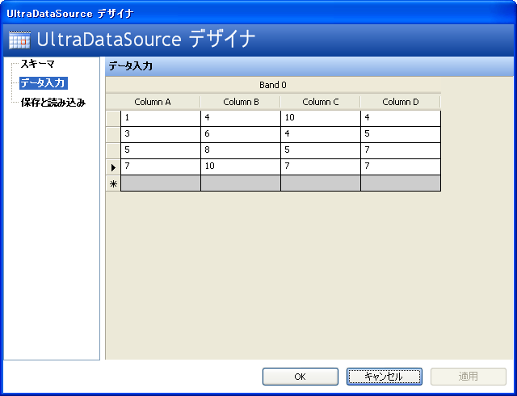

////

|metadata|
{
    "name": "chart-binding-to-windatasource",
    "controlName": ["{WawChartName}"],
    "tags": [],
    "guid": "{6344A9C8-95F5-4225-8506-6549FFF6145C}",  
    "buildFlags": ["win-forms","win-forms-old"],
    "createdOn": "0001-01-01T00:00:00Z"
}
|metadata|
////

= WinDataSource へのバインディング

Chart コントロールをバインドできるデータ ソースのひとつは WinDataSource コンポーネントです。このトピックは、グラフを WinDataSource にバインドするための手順を説明します。

[NOTE]
====
*注：* WinDataSource コンポーネントでの作業方法については、 link:windatasource-using-the-windatasource-designer.html[「UltraDataSource デザイナの使用」]を参照してください。
====

バインドしたいチャート タイプの有効なデータを使用して WinDataSource を設定します。以下のスクリーンショットは、Chart コントロールをバインドできるデータのサンプル セットを添付した WinDataSource デザイナのデータ入力フォームを示しています。以下の例のコードは、Chart を WinDataSource にバインドする方法を示しています。

[NOTE]
====
*注：* 各 DataColumns DataType を数値タイプに変更してください。そうしなければ、ランタイムに例外が発生します。
====

*Visual Basic の場合：*

----
Private Sub Binding_to_WinDataSource_Load(ByVal sender As System.Object, _
  ByVal e As System.EventArgs) Handles MyBase.Load
	Me.UltraChart1.DataSource = Me.UltraDataSource1
End Sub
----

*C# の場合：*

----
private void Binding_to_WinDataSource_Load(object sender, EventArgs e)
{
	this.ultraChart1.DataSource = this.ultraDataSource1;
}
----