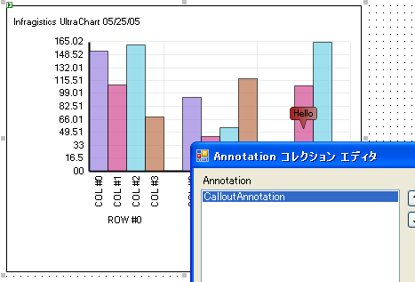

////

|metadata|
{
    "name": "chart-create-annotations",
    "controlName": ["{WawChartName}"],
    "tags": [],
    "guid": "{26FF22B0-B1DB-47F8-8034-BAF66EACE129}",  
    "buildFlags": [],
    "createdOn": "0001-01-01T00:00:00Z"
}
|metadata|
////

= 注釈の作成

Infragistics 2005 Volume 1 リリースでは、注釈と呼ばれる新しい項目がチャート コントロールに追加されました。これらのチャート要素は、既存のチャート データを補足して、視覚的なキューまたは情報を提供するために使用できます。チャート上の特定の位置を指し示す追加のラベル、矢印、その他の形状で表示されます。

[NOTE]
====
*注* ：このトピックでは、チャートはすでに  pick:[win-forms="link:{ApiPlatform}win.ultrawinchart{ApiVersion}~infragistics.win.ultrawinchart.ultrachart~datasource.html[DataSource]"]  pick:[asp-net="link:{ApiPlatform}webui.ultrawebchart{ApiVersion}~infragistics.webui.ultrawebchart.ultrachart~datasource.html[DataSource]"]  pick:[aspnet-old="link:{ApiPlatform}webui.ultrawebchart{ApiVersion}~infragistics.webui.ultrawebchart.ultrachart~datasource.html[DataSource]"]  プロパティが設定されていることを前提とします。これを実行する詳細は、 link:chart-data-sources.html[「データ ソース」]を参照してください。
====

=== グラフ注釈を作成するには、以下の手順に従ってください。

[start=1]
. フォームの [プロパティ] ウィンドウで、 pick:[win-forms="link:{ApiPlatform}win.ultrawinchart{ApiVersion}~infragistics.ultrachart.resources.appearance.annotation.html[Annotations]"]  pick:[asp-net="link:{ApiPlatform}webui.ultrawebchart{ApiVersion}~infragistics.ultrachart.resources.appearance.annotation.html[Annotations]"]  pick:[aspnet-old="link:{ApiPlatform}webui.ultrawebchart{ApiVersion}~infragistics.ultrachart.resources.appearance.annotation.html[Annotations]"]  プロパティをダブルクリックして展開します。
[start=2]
. image::images/Chart_Creating_Annotations_01.png[]

[start=3]
. Annotations プロパティで Annotations プロパティをクリックし、次に省略記号 (...) ボタンをクリックして ［グラフ注釈エディタ］ ダイアログ ボックスを開きます。
[start=4]
. image::images/Chart_Creating_Annotations_02.png[]

[start=5]
. エディタの左側にある [追加] ボタンをクリックして、使用可能なすべての注釈のドロップダウンを表示します。
[start=6]
. image::images/Chart_Creating_Annotations_03.png[]

[start=7]
. この例の手順では、[吹き出し注釈を追加] をドロップダウン メニューから選択します。 pick:[win-forms="link:{ApiPlatform}win.ultrawinchart{ApiVersion}~infragistics.ultrachart.resources.appearance.calloutannotation.html[CalloutAnnotation]"]  pick:[asp-net="link:{ApiPlatform}webui.ultrawebchart{ApiVersion}~infragistics.ultrachart.resources.appearance.calloutannotation.html[CalloutAnnotation]"]  pick:[aspnet-old="link:{ApiPlatform}webui.ultrawebchart{ApiVersion}~infragistics.ultrachart.resources.appearance.calloutannotation.html[CalloutAnnotation]"]  プロパティがダイアログ ボックスの左側ペインの注釈リストボックスに追加され、そのプロパティがダイアログ ボックスの右側のペインに表示されます。
[start=8]
. image::images/Chart_Creating_Annotations_04.png[]

[start=9]
. ダイアログ ボックスの右側ペインで、 pick:[win-forms="link:{ApiPlatform}win.ultrawinchart{ApiVersion}~infragistics.ultrachart.resources.appearance.annotation~location.html[Location]"]  pick:[asp-net="link:{ApiPlatform}webui.ultrawebchart{ApiVersion}~infragistics.ultrachart.resources.appearance.annotation~location.html[Location]"]  pick:[aspnet-old="link:{ApiPlatform}webui.ultrawebchart{ApiVersion}~infragistics.ultrachart.resources.appearance.annotation~location.html[Location]"]  プロパティをクリックして展開します。Location プロパティは、すべてのグラフ注釈の最も基本的なプロパティのひとつです。
[start=10]
. Location プロパティを設定する場合の最初の質問は、この注釈に使用する配置タイプです。Location プロパティでは、Type プロパティをクリックし、ドロップダウン矢印をクリックして使用できる配置タイプを表示します。
[start=11]
. 

**  pick:[win-forms="link:{ApiPlatform}win.ultrawinchart{ApiVersion}~infragistics.ultrachart.shared.styles.locationtype.html[LocationType.RowColumn]"]  pick:[asp-net="link:{ApiPlatform}webui.ultrawebchart{ApiVersion}~infragistics.ultrachart.shared.styles.locationtype.html[LocationType.RowColumn]"]  pick:[aspnet-old="link:{ApiPlatform}webui.ultrawebchart{ApiVersion}~infragistics.ultrachart.shared.styles.locationtype.html[LocationType.RowColumn]"]  -- 注釈は、Row プロパティと Column プロパティに一致する各グラフ データ項目の上に配置されます。これらの値は、データソース内の対応する行と列のゼロベース インデックスに一致するように設定する必要があります。すべての行または列（あるいは両方）を一致させるには、Row または Column プロパティ（あるいは両方のプロパティ）を -2 に設定します。-2 は、行または列（あるいはその両方）一致のワイルドカードを表す値です。
**  pick:[win-forms="link:{ApiPlatform}win.ultrawinchart{ApiVersion}~infragistics.ultrachart.shared.styles.locationtype.html[LocationType.DataValues]"]  pick:[asp-net="link:{ApiPlatform}webui.ultrawebchart{ApiVersion}~infragistics.ultrachart.shared.styles.locationtype.html[LocationType.DataValues]"]  pick:[aspnet-old="link:{ApiPlatform}webui.ultrawebchart{ApiVersion}~infragistics.ultrachart.shared.styles.locationtype.html[LocationType.DataValues]"]  -- 注釈は、X 軸と Y 軸上にマップされたポイントに配置されます。これらの軸上にマップする値は、Location の  pick:[win-forms="link:{ApiPlatform}win.ultrawinchart{ApiVersion}~infragistics.ultrachart.resources.appearance.location~valuex.html[ValueX]"]  pick:[asp-net="link:{ApiPlatform}webui.ultrawebchart{ApiVersion}~infragistics.ultrachart.resources.appearance.location~valuex.html[ValueX]"]  pick:[aspnet-old="link:{ApiPlatform}webui.ultrawebchart{ApiVersion}~infragistics.ultrachart.resources.appearance.location~valuex.html[ValueX]"]  および  pick:[win-forms="link:{ApiPlatform}win.ultrawinchart{ApiVersion}~infragistics.ultrachart.resources.appearance.location~valuey.html[ValueY]"]  pick:[asp-net="link:{ApiPlatform}webui.ultrawebchart{ApiVersion}~infragistics.ultrachart.resources.appearance.location~valuey.html[ValueY]"]  pick:[aspnet-old="link:{ApiPlatform}webui.ultrawebchart{ApiVersion}~infragistics.ultrachart.resources.appearance.location~valuey.html[ValueY]"]  プロパティで指定します。
**  pick:[win-forms="link:{ApiPlatform}win.ultrawinchart{ApiVersion}~infragistics.ultrachart.shared.styles.locationtype.html[LocationType.Pixels]"]  pick:[asp-net="link:{ApiPlatform}webui.ultrawebchart{ApiVersion}~infragistics.ultrachart.shared.styles.locationtype.html[LocationType.Pixels]"]  pick:[aspnet-old="link:{ApiPlatform}webui.ultrawebchart{ApiVersion}~infragistics.ultrachart.shared.styles.locationtype.html[LocationType.Pixels]"]  -- 注釈は、グラフの左上隅からの距離（ピクセル単位）に基づいたポイントに配置されます。これらの水平と垂直方向（X と Y）の距離（ピクセル単位）は、Location の  pick:[win-forms="link:{ApiPlatform}win.ultrawinchart{ApiVersion}~infragistics.ultrachart.resources.appearance.location~locationx.html[LocationX]"]  pick:[asp-net="link:{ApiPlatform}webui.ultrawebchart{ApiVersion}~infragistics.ultrachart.resources.appearance.location~locationx.html[LocationX]"]  pick:[aspnet-old="link:{ApiPlatform}webui.ultrawebchart{ApiVersion}~infragistics.ultrachart.resources.appearance.location~locationx.html[LocationX]"]  および  pick:[win-forms="link:{ApiPlatform}win.ultrawinchart{ApiVersion}~infragistics.ultrachart.resources.appearance.location~locationy.html[LocationY]"]  pick:[asp-net="link:{ApiPlatform}webui.ultrawebchart{ApiVersion}~infragistics.ultrachart.resources.appearance.location~locationy.html[LocationY]"]  pick:[aspnet-old="link:{ApiPlatform}webui.ultrawebchart{ApiVersion}~infragistics.ultrachart.resources.appearance.location~locationy.html[LocationY]"]  プロパティで指定します。
**  pick:[win-forms="link:{ApiPlatform}win.ultrawinchart{ApiVersion}~infragistics.ultrachart.shared.styles.locationtype.html[LocationType.Percentage]"]  pick:[asp-net="link:{ApiPlatform}webui.ultrawebchart{ApiVersion}~infragistics.ultrachart.shared.styles.locationtype.html[LocationType.Percentage]"]  pick:[aspnet-old="link:{ApiPlatform}webui.ultrawebchart{ApiVersion}~infragistics.ultrachart.shared.styles.locationtype.html[LocationType.Percentage]"]  -- 注釈は、グラフの左上隅からの距離（パーセント）に基づいたポイントに配置されます。これらの水平と垂直方向（X と Y）の距離（パーセント単位）は、Location の LocationX と LocationY プロパティで指定します。注釈をグラフ領域に表示する場合、これらの値の有効範囲は 0～100 です。

[start=12]
. Type プロパティを  pick:[win-forms="link:{ApiPlatform}win.ultrawinchart{ApiVersion}~infragistics.ultrachart.shared.styles.locationtype.html[RowColumn]"]  pick:[asp-net="link:{ApiPlatform}webui.ultrawebchart{ApiVersion}~infragistics.ultrachart.shared.styles.locationtype.html[RowColumn]"]  pick:[aspnet-old="link:{ApiPlatform}webui.ultrawebchart{ApiVersion}~infragistics.ultrachart.shared.styles.locationtype.html[RowColumn]"]  のデフォルト値にままにします。
[start=13]
.  pick:[win-forms="link:{ApiPlatform}win.ultrawinchart{ApiVersion}~infragistics.ultrachart.resources.appearance.location~column.html[Column]"]  pick:[asp-net="link:{ApiPlatform}webui.ultrawebchart{ApiVersion}~infragistics.ultrachart.resources.appearance.location~column.html[Column]"]  pick:[aspnet-old="link:{ApiPlatform}webui.ultrawebchart{ApiVersion}~infragistics.ultrachart.resources.appearance.location~column.html[Column]"]  プロパティの値を 1 に変更します。
[start=14]
. Row プロパティの値を 2 に変更します。
[start=15]
.  pick:[win-forms="link:{ApiPlatform}win.ultrawinchart{ApiVersion}~infragistics.ultrachart.resources.appearance.calloutannotation~text.html[Text]"]  pick:[asp-net="link:{ApiPlatform}webui.ultrawebchart{ApiVersion}~infragistics.ultrachart.resources.appearance.calloutannotation~text.html[Text]"]  pick:[aspnet-old="link:{ApiPlatform}webui.ultrawebchart{ApiVersion}~infragistics.ultrachart.resources.appearance.calloutannotation~text.html[Text]"]  プロパティをクリックして、吹き出し注釈の名前を入力します。Text プロパティ フィールドの外側をクリックし、[グラフ注釈エディタ] エディタを移動すると、グラフに表示される吹き出し注釈を確認できます。
[start=16]
. [グラフ注釈エディタ] ダイアログ ボックスの右側の領域で、 pick:[win-forms="link:{ApiPlatform}win.ultrawinchart{ApiVersion}~infragistics.ultrachart.resources.appearance.calloutannotation~pe.html[PE]"]  pick:[asp-net="link:{ApiPlatform}webui.ultrawebchart{ApiVersion}~infragistics.ultrachart.resources.appearance.calloutannotation~pe.html[PE]"]  pick:[aspnet-old="link:{ApiPlatform}webui.ultrawebchart{ApiVersion}~infragistics.ultrachart.resources.appearance.calloutannotation~pe.html[PE]"] （ pick:[win-forms="link:{ApiPlatform}win.ultrawinchart{ApiVersion}~infragistics.ultrachart.resources.appearance.paintelement.html[PaintElement]"]  pick:[asp-net="link:{ApiPlatform}webui.ultrawebchart{ApiVersion}~infragistics.ultrachart.resources.appearance.paintelement.html[PaintElement]"]  pick:[aspnet-old="link:{ApiPlatform}webui.ultrawebchart{ApiVersion}~infragistics.ultrachart.resources.appearance.paintelement.html[PaintElement]"] ）プロパティをダブルクリックします。このプロパティによって、注釈の外観を変更できます。
[start=17]
. 

この例の手順では、以下のプロパティ設定を変更します。
pick:[win-forms="link:{ApiPlatform}win.ultrawinchart{ApiVersion}~infragistics.ultrachart.resources.appearance.paintelement~elementtype.html[ElementType]"]  pick:[asp-net="link:{ApiPlatform}webui.ultrawebchart{ApiVersion}~infragistics.ultrachart.resources.appearance.paintelement~elementtype.html[ElementType]"]  pick:[aspnet-old="link:{ApiPlatform}webui.ultrawebchart{ApiVersion}~infragistics.ultrachart.resources.appearance.paintelement~elementtype.html[ElementType]"]  プロパティ -- グラデーション
pick:[win-forms="link:{ApiPlatform}win.ultrawinchart{ApiVersion}~infragistics.ultrachart.resources.appearance.paintelement~fill.html[Fill]"]  pick:[asp-net="link:{ApiPlatform}webui.ultrawebchart{ApiVersion}~infragistics.ultrachart.resources.appearance.paintelement~fill.html[Fill]"]  pick:[aspnet-old="link:{ApiPlatform}webui.ultrawebchart{ApiVersion}~infragistics.ultrachart.resources.appearance.paintelement~fill.html[Fill]"]  プロパティ -- 茶色
pick:[win-forms="link:{ApiPlatform}win.ultrawinchart{ApiVersion}~infragistics.ultrachart.resources.appearance.paintelement~fillgradientstyle.html[FillGradientStyle]"]  pick:[asp-net="link:{ApiPlatform}webui.ultrawebchart{ApiVersion}~infragistics.ultrachart.resources.appearance.paintelement~fillgradientstyle.html[FillGradientStyle]"]  pick:[aspnet-old="link:{ApiPlatform}webui.ultrawebchart{ApiVersion}~infragistics.ultrachart.resources.appearance.paintelement~fillgradientstyle.html[FillGradientStyle]"]  プロパティ -- 水平
pick:[win-forms="link:{ApiPlatform}win.ultrawinchart{ApiVersion}~infragistics.ultrachart.resources.appearance.paintelement~fillstopcolor.html[FillStopColor]"]  pick:[asp-net="link:{ApiPlatform}webui.ultrawebchart{ApiVersion}~infragistics.ultrachart.resources.appearance.paintelement~fillstopcolor.html[FillStopColor]"]  pick:[aspnet-old="link:{ApiPlatform}webui.ultrawebchart{ApiVersion}~infragistics.ultrachart.resources.appearance.paintelement~fillstopcolor.html[FillStopColor]"]  プロパティ -- RosyBrown

グラフ注釈は、以下のスクリーンショットの注釈のように見えます。

[start=18]
. 注釈で吹き出しのテキストを自動調整できるようにするには、 pick:[win-forms="link:{ApiPlatform}win.ultrawinchart{ApiVersion}~infragistics.ultrachart.resources.appearance.calloutannotation~height.html[Height]"]  pick:[asp-net="link:{ApiPlatform}webui.ultrawebchart{ApiVersion}~infragistics.ultrachart.resources.appearance.calloutannotation~height.html[Height]"]  pick:[aspnet-old="link:{ApiPlatform}webui.ultrawebchart{ApiVersion}~infragistics.ultrachart.resources.appearance.calloutannotation~height.html[Height]"]  および  pick:[win-forms="link:{ApiPlatform}win.ultrawinchart{ApiVersion}~infragistics.ultrachart.resources.appearance.calloutannotation~width.html[Width]"]  pick:[asp-net="link:{ApiPlatform}webui.ultrawebchart{ApiVersion}~infragistics.ultrachart.resources.appearance.calloutannotation~width.html[Width]"]  pick:[aspnet-old="link:{ApiPlatform}webui.ultrawebchart{ApiVersion}~infragistics.ultrachart.resources.appearance.calloutannotation~width.html[Width]"]  プロパティの両方の値を -1 に変更します。