////

|metadata|
{
    "name": "chart-creating-a-composite-chart-using-the-chart-wizard-part-1-of-2",
    "controlName": ["{WawChartName}"],
    "tags": [],
    "guid": "{E48400D5-1AB9-4C7D-831D-55C0F4597BA4}",  
    "buildFlags": [],
    "createdOn": "0001-01-01T00:00:00Z"
}
|metadata|
////

= チャート ウィザードを使用して合成チャートを作成（1/2）

このチュートリアルは、チャート ウィザードを使用して link:chart-composite-chart.html[合成チャート]の作成プロセスを説明します。このチュートリアルが終わるまでに合成チャートのデザインのすべての知識が得られます。

== 合成チャートの基本設定

合成チャートの最初のチャート レイヤを設定するために必要ないくつかの手順があります。合成チャートでチャートを完全に制御できるようにするには、グラフ領域、軸、およびチャート レイヤなどの個々の要素をすべて手動で追加する必要があります。最初のセクションでは、これらの最初の手順を詳細に学習します。

このセクションの最後では、2 つの軸、1 つのチャート レイヤ、および凡例を持つ合成チャートを作成します。

[start=1]
. チャート ウィザードを開きます。

チャート ウィザードは、チャートをはじめてフォームにドラッグすると開きます。た、デザイナのチャート コントロールを右クリックし、表示されるコンテキスト メニューから ［チャート ウィザード］ を選択して、ウィザードを開くことができます。

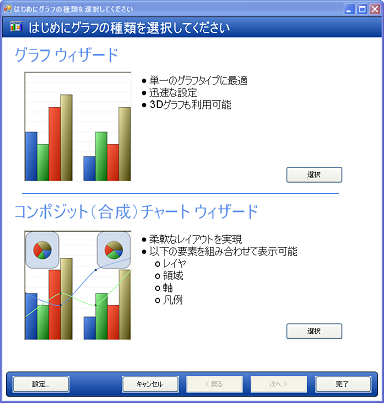

[start=2]
. 青いボタンまたは合成チャートの画像をクリックして合成チャート ウィザードを起動します。

合成チャート ウィザードが表示されます。画面の上部に表示されるタブは合成チャートの作成手順を示しますが、合成チャートのデザインは必ずしも単純な処理ではないので、これらの手順を前後することができます。画面の下部にある [次へ] または [戻る] ボタンをクリックして、選択したタブを変更し、または ［チャート ウィザードの選択］ 画面に戻ります。

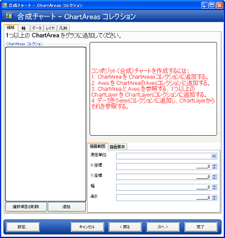

[start=3]
. pick:[win-forms="link:{ApiPlatform}win.ultrawinchart{ApiVersion}~infragistics.ultrachart.resources.appearance.chartarea.html[ChartArea]"]  pick:[asp-net="link:{ApiPlatform}webui.ultrawebchart{ApiVersion}~infragistics.ultrachart.resources.appearance.chartarea.html[ChartArea]"]  pick:[aspnet-old="link:{ApiPlatform}webui.ultrawebchart{ApiVersion}~infragistics.ultrachart.resources.appearance.chartarea.html[ChartArea]"]  を  pick:[win-forms="link:{ApiPlatform}win.ultrawinchart{ApiVersion}~infragistics.ultrachart.resources.appearance.compositechartappearance~chartareas.html[ChartAreas]"]  pick:[asp-net="link:{ApiPlatform}webui.ultrawebchart{ApiVersion}~infragistics.ultrachart.resources.appearance.compositechartappearance~chartareas.html[ChartAreas]"]  pick:[aspnet-old="link:{ApiPlatform}webui.ultrawebchart{ApiVersion}~infragistics.ultrachart.resources.appearance.compositechartappearance~chartareas.html[ChartAreas]"]  コレクションに追加します。

これは、チャート ウィザードの左下隅にある [追加] ボタンをクリックして実行します。新しい ChartArea（area1）のキーが ListBox に表示され、チャートの表面が白くなります。チャートに 1 つの ChartArea が描画され、コントロール面全体をカバーします。

pick:[win-forms="link:{ApiPlatform}win.ultrawinchart{ApiVersion}~infragistics.ultrachart.resources.appearance.chartarea~axes.html[Axes]"]  pick:[asp-net="link:{ApiPlatform}webui.ultrawebchart{ApiVersion}~infragistics.ultrachart.resources.appearance.chartarea~axes.html[Axes]"]  pick:[aspnet-old="link:{ApiPlatform}webui.ultrawebchart{ApiVersion}~infragistics.ultrachart.resources.appearance.chartarea~axes.html[Axes]"]  をこの ChartArea コレクションに追加します。
[start=4]
. Axes タブを変更して X 軸および Y 軸に追加します。

[軸] タブに変更し、選択した ChartArea（area1）の Axes コレクションを表示します。[追加] ボタンをクリックして、表示されたコンテキスト メニューから X 軸を選択します。もう一度クリックして「Y 軸」を選択します。2 つの軸が ListBox およびチャートに表示されます。

ここで、2 つの  pick:[win-forms="link:{ApiPlatform}win.ultrawinchart{ApiVersion}~infragistics.ultrachart.resources.appearance.axisitem.html[AxisItem]"]  pick:[asp-net="link:{ApiPlatform}webui.ultrawebchart{ApiVersion}~infragistics.ultrachart.resources.appearance.axisitem.html[AxisItem]"]  pick:[aspnet-old="link:{ApiPlatform}webui.ultrawebchart{ApiVersion}~infragistics.ultrachart.resources.appearance.axisitem.html[AxisItem]"]  オブジェクトが現在の ChartArea の Axes コレクションに追加されており、ひとつのオブジェクトは  pick:[win-forms="link:{ApiPlatform}win.ultrawinchart{ApiVersion}~infragistics.ultrachart.resources.appearance.axislabelappearancebase~orientation.html[Orientation]"]  pick:[asp-net="link:{ApiPlatform}webui.ultrawebchart{ApiVersion}~infragistics.ultrachart.resources.appearance.axislabelappearancebase~orientation.html[Orientation]"]  pick:[aspnet-old="link:{ApiPlatform}webui.ultrawebchart{ApiVersion}~infragistics.ultrachart.resources.appearance.axislabelappearancebase~orientation.html[Orientation]"]  プロパティが "X_Axis" に、もうひとつのオブジェクトは Orientation プロパティが "Y_Axis" に設定されています。

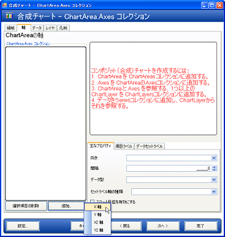

[start=5]
. 柱状グラフ レイヤで使用する軸を設定します。

このサンプルで最初に追加するレイヤは柱状グラフ レイヤです。したがって、柱状グラフ レイヤーの要件を満たすためにこれらの軸を設定しなければなりません。

link:chart-axis-requirements-for-composite-charts.html[合成チャートの軸要件]のトピックに記載されているように、柱状グラフ レイヤは、X 軸が文字列の DataType と GroupBySeries の  pick:[win-forms="link:{ApiPlatform}win.ultrawinchart{ApiVersion}~infragistics.ultrachart.resources.appearance.axisitem~setlabelaxistype.html[SetLabelAxisType]"]  pick:[asp-net="link:{ApiPlatform}webui.ultrawebchart{ApiVersion}~infragistics.ultrachart.resources.appearance.axisitem~setlabelaxistype.html[SetLabelAxisType]"]  pick:[aspnet-old="link:{ApiPlatform}webui.ultrawebchart{ApiVersion}~infragistics.ultrachart.resources.appearance.axisitem~setlabelaxistype.html[SetLabelAxisType]"]  を持ち、Y 軸は数値型 DataType を持つ必要があります。これらのプロパティは、チャート ウィザードの右下の  pick:[win-forms="link:{ApiPlatform}win.ultrawinchart{ApiVersion}~infragistics.ultrachart.resources.appearance.axisitem~key.html[Key]"]  pick:[asp-net="link:{ApiPlatform}webui.ultrawebchart{ApiVersion}~infragistics.ultrachart.resources.appearance.axisitem~key.html[Key]"]  pick:[aspnet-old="link:{ApiPlatform}webui.ultrawebchart{ApiVersion}~infragistics.ultrachart.resources.appearance.axisitem~key.html[Key]"]  プロパティ タブで設定できます。

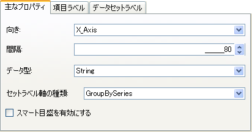

編集する軸を変更するには、チャート ウィザードの左側の ListBox で編集する軸を選択します。

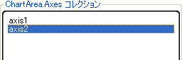

前述のように X 軸と Y 軸を設定後、各軸に  pick:[win-forms="link:{ApiPlatform}win.ultrawinchart{ApiVersion}~infragistics.ultrachart.resources.appearance.axislabelappearance~itemformat.html[ItemFormat]"]  pick:[asp-net="link:{ApiPlatform}webui.ultrawebchart{ApiVersion}~infragistics.ultrachart.resources.appearance.axislabelappearance~itemformat.html[ItemFormat]"]  pick:[aspnet-old="link:{ApiPlatform}webui.ultrawebchart{ApiVersion}~infragistics.ultrachart.resources.appearance.axislabelappearance~itemformat.html[ItemFormat]"]  を設定します。柱状グラフでは、X 軸が項目ラベルを表示し、Y 軸がデータ値を表示するのが理想的な設定です。したがって、X 軸（axis1）の ItemFormat は「ItemLabel」に設定し、Y 軸（axis2）の ItemFormat は「DataValue」に設定します。この変更はチャート ウィザードの右下の領域にある [項目ラベル] タブを選択してプロパティ グリッドで「ItemFormat」の値を変更することで行うことができます。

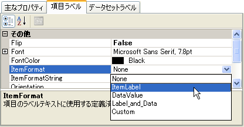

X 軸に垂直方向のラベルを付けることも理想的です。この変更は、同じプロパティ グリッドで Orientation プロパティを axisX の VerticalLeftFacing に変更することで行うことができます。
[start=6]
. [データ] タブに変更し、2 つの数値 Series を追加します。

これはチャート ウィザードの左側の [新規追加] ボタンをクリックして [Numeric Series] を選択することで行うことができます。これを 2 度行います。

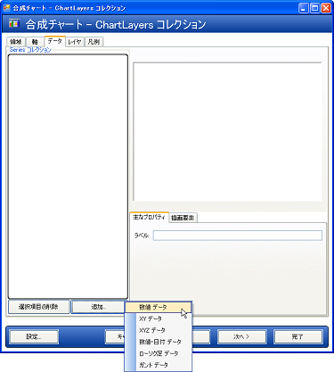

そして、2 つのデータセットのそれぞれのグリッドでデータを入力します。以下のようにサンプル データを入力します。

[cols="a,a"]
|====
|Label
|Value

|アイテム A
|1

|アイテム B
|2

|アイテム C
|3

|アイテム D
|4

|アイテム E
|5

|====

[Key プロパティ] タブのエディタを使用して、データセットにラベルを割り当てます。データセットを Series A と Series B と呼びます。

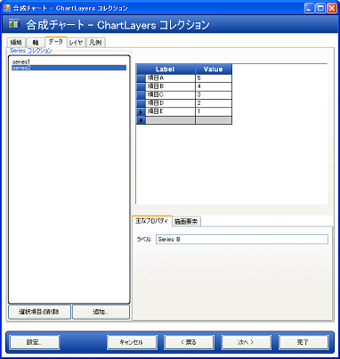

[start=7]
. [チャート レイヤ] タブに変更し、チャート レイヤを追加します。

もう一度、[新規追加] ボタンをクリックして実行します。これで  pick:[win-forms="link:{ApiPlatform}win.ultrawinchart{ApiVersion}~infragistics.ultrachart.resources.appearance.chartlayerappearance.html[ChartLayer]"]  pick:[asp-net="link:{ApiPlatform}webui.ultrawebchart{ApiVersion}~infragistics.ultrachart.resources.appearance.chartlayerappearance.html[ChartLayer]"]  pick:[aspnet-old="link:{ApiPlatform}webui.ultrawebchart{ApiVersion}~infragistics.ultrachart.resources.appearance.chartlayerappearance.html[ChartLayer]"]  が  pick:[win-forms="link:{ApiPlatform}win.ultrawinchart{ApiVersion}~infragistics.ultrachart.resources.appearance.compositechartappearance~chartlayers.html[ChartLayers]"]  pick:[asp-net="link:{ApiPlatform}webui.ultrawebchart{ApiVersion}~infragistics.ultrachart.resources.appearance.compositechartappearance~chartlayers.html[ChartLayers]"]  pick:[aspnet-old="link:{ApiPlatform}webui.ultrawebchart{ApiVersion}~infragistics.ultrachart.resources.appearance.compositechartappearance~chartlayers.html[ChartLayers]"]  コレクションに追加されます。

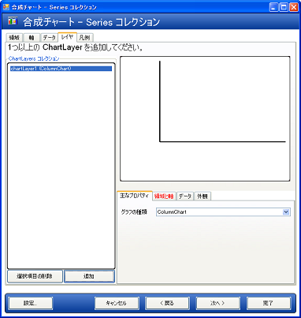

チャート ウィザードの右下の [領域と軸] タブを選択し、柱状グラフ レイヤの ChartArea と軸を設定します。ChartArea で area1、AxisX で axis1、そして AxisY で axis2 を選択します。

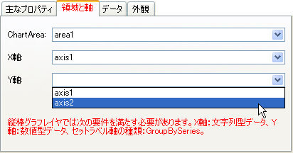

このタブで、柱状グラフ レイヤの軸の要件が赤いテキストで表示されることに注意してください。要件が満たされると赤いテキストは表示されなくなります。

ここで、[データ] タブを選択し、柱状グラフ レイヤで使用する両方のデータセットを選択します。

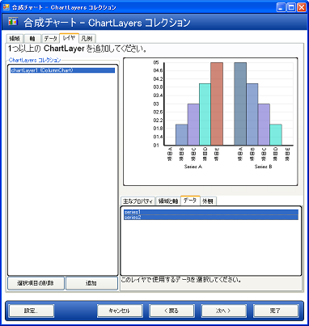

2 つの軸を持つ単一の ChartArea の合成チャートが 1 つのチャート レイヤを描画します。
[start=8]
. pick:[win-forms="link:{ApiPlatform}win.ultrawinchart{ApiVersion}~infragistics.ultrachart.resources.appearance.compositelegend.html[凡例]"]  pick:[asp-net="link:{ApiPlatform}webui.ultrawebchart{ApiVersion}~infragistics.ultrachart.resources.appearance.compositechartappearance~legends.html[凡例]"]  pick:[aspnet-old="link:{ApiPlatform}webui.ultrawebchart{ApiVersion}~infragistics.ultrachart.resources.appearance.compositechartappearance~legends.html[凡例]"] をチャートに追加します。

[凡例] タブに変更し、[追加] をクリックして、凡例を追加します。

合成チャートの凡例がチャート レイヤを使用するため、チャート ウィザードの右下隅にある ChartLayers ListBox で唯一のチャート レイヤ（chartLayer1）を選択します。この ListBox でレイヤを選択すると、選択した凡例の ChartLayers コレクションに追加されます。

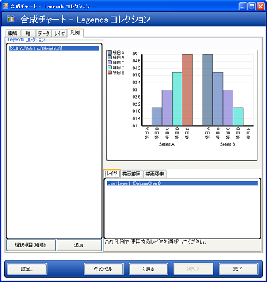

デフォルトで、凡例の枠は Rectangle.Empty に設定されます。したがって、凡例はグラフ面全体を占有し、左上隅から項目の描画が開始されます。凡例の枠をカスタマイズして、グラフの任意の場所に配置し、凡例の枠と背景の  pick:[win-forms="link:{ApiPlatform}win.ultrawinchart{ApiVersion}~infragistics.ultrachart.resources.appearance.paintelement.html[PaintElement]"]  pick:[asp-net="link:{ApiPlatform}webui.ultrawebchart{ApiVersion}~infragistics.ultrachart.resources.appearance.paintelement.html[aintElement]"]  も同様にカスタマイズできます。チャート ウィザードで、これらのプロパティを試行して、どのように動作するか感触をつかみます。

以下の画像では、凡例の  pick:[win-forms="link:{ApiPlatform}win.ultrawinchart{ApiVersion}~infragistics.ultrachart.resources.appearance.compositelegend~bounds.html[Bounds]"]  pick:[asp-net="link:{ApiPlatform}webui.ultrawebchart{ApiVersion}~infragistics.ultrachart.resources.appearance.compositelegend~bounds.html[Bounds]"]  pick:[aspnet-old="link:{ApiPlatform}webui.ultrawebchart{ApiVersion}~infragistics.ultrachart.resources.appearance.compositelegend~bounds.html[Bounds]"]  はパーセントの  pick:[win-forms="link:{ApiPlatform}win.ultrawinchart{ApiVersion}~infragistics.ultrachart.resources.appearance.compositelegend~boundsmeasuretype.html[MeasureType]"]  pick:[asp-net="link:{ApiPlatform}webui.ultrawebchart{ApiVersion}~infragistics.ultrachart.resources.appearance.compositelegend~boundsmeasuretype.html[MeasureType]"]  pick:[aspnet-old="link:{ApiPlatform}webui.ultrawebchart{ApiVersion}~infragistics.ultrachart.resources.appearance.compositelegend~boundsmeasuretype.html[MeasureType]"]  で {X=0, Y=75, Width=20, } に設定されています。凡例の PaintElement は、CornflowerBlue から Transparent への ForwardDiagonal グラデーションに設定されています。

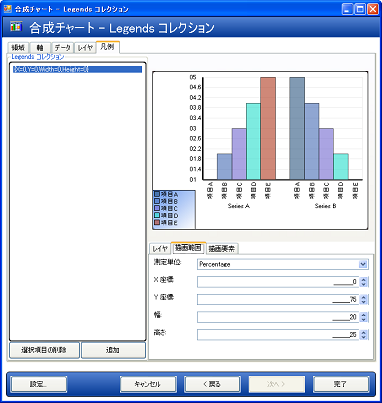

== 関連トピック

link:chart-axis-requirements-for-composite-charts.html[合成チャートの軸要件]

link:chart-layers.html[レイヤ]