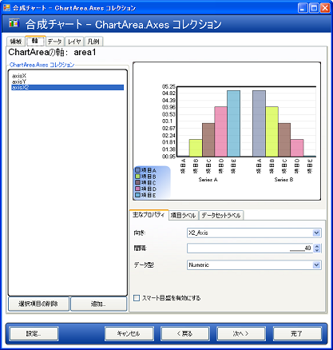
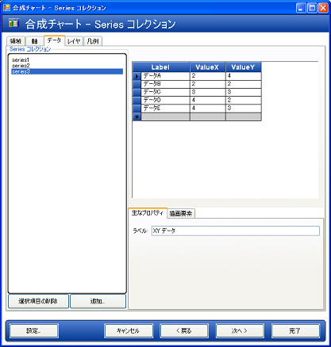
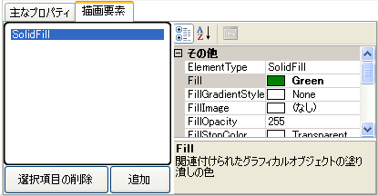
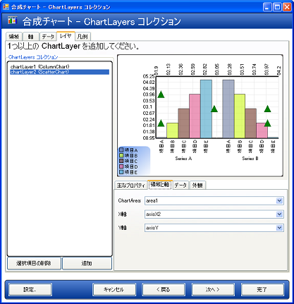

////

|metadata|
{
    "name": "chart-creating-a-composite-chart-using-the-chart-wizard-part-2-of-2",
    "controlName": ["{WawChartName}"],
    "tags": [],
    "guid": "{ADFC3368-9928-4F4C-A50F-291FE9FE0757}",  
    "buildFlags": [],
    "createdOn": "0001-01-01T00:00:00Z"
}
|metadata|
////

= チャート ウィザードを使用して合成チャートを作成（2/2）

このトピックでは、 link:chart-creating-a-composite-chart-using-the-chart-wizard-part-1-of-2.html[チャート ウィザードを使用して合成チャートを作成（パート 1/2）]トピックについて詳しく説明し、レイヤ、グラフ領域、および凡例の追加による link:chart-composite-chart.html[合成チャート]の威力と柔軟性を示します。

[start=1]
. pick:[win-forms="link:{ApiPlatform}win.ultrawinchart{ApiVersion}~infragistics.ultrachart.resources.appearance.chartarea.html[ChartArea]"]  pick:[asp-net="link:{ApiPlatform}webui.ultrawebchart{ApiVersion}~infragistics.ultrachart.resources.appearance.chartarea.html[ChartArea]"]  pick:[aspnet-old="link:{ApiPlatform}webui.ultrawebchart{ApiVersion}~infragistics.ultrachart.resources.appearance.chartarea.html[ChartArea]"]  への別の軸の追加。

別のレイヤを追加する前に、少なくとも 1 つの軸を追加する必要があります。これは、ほとんどのチャート レイヤでラベル用の軸が必要になり、チャート レイヤがラベル軸を共有できないからです。

[ pick:[win-forms="link:{ApiPlatform}win.ultrawinchart{ApiVersion}~infragistics.ultrachart.resources.appearance.chartarea~axes.html[軸]"]  pick:[asp-net="link:{ApiPlatform}webui.ultrawebchart{ApiVersion}~infragistics.ultrachart.resources.appearance.chartarea~axes.html[軸]"]  pick:[aspnet-old="link:{ApiPlatform}webui.ultrawebchart{ApiVersion}~infragistics.ultrachart.resources.appearance.chartarea~axes.html[軸]"] ] タブに変更し、X2 スタイル軸（axis3）を追加します。これでグラフの上部から方向付けられた軸が追加されます。

DataType を Numeric に設定します。この軸でデータ値を表示できるように、 pick:[win-forms="link:{ApiPlatform}win.ultrawinchart{ApiVersion}~infragistics.ultrachart.resources.appearance.axislabelappearance~itemformat.html[ItemLabels.ItemFormat]"]  pick:[asp-net="link:{ApiPlatform}webui.ultrawebchart{ApiVersion}~infragistics.ultrachart.resources.appearance.axislabelappearance~itemformat.html[ItemLabels.ItemFormat]"]  pick:[aspnet-old="link:{ApiPlatform}webui.ultrawebchart{ApiVersion}~infragistics.ultrachart.resources.appearance.axislabelappearance~itemformat.html[ItemLabels.ItemFormat]"]  を DataValue に設定します。 pick:[win-forms="link:{ApiPlatform}win.ultrawinchart{ApiVersion}~infragistics.ultrachart.resources.appearance.axislabelappearancebase~orientation.html[ItemLabels.Orientation]"]  pick:[asp-net="link:{ApiPlatform}webui.ultrawebchart{ApiVersion}~infragistics.ultrachart.resources.appearance.axislabelappearancebase~orientation.html[ItemLabels.Orientation]"]  pick:[aspnet-old="link:{ApiPlatform}webui.ultrawebchart{ApiVersion}~infragistics.ultrachart.resources.appearance.axislabelappearancebase~orientation.html[ItemLabels.Orientation]"]  を "VerticalLeftFacing" に設定します。次に、 pick:[win-forms="link:{ApiPlatform}win.ultrawinchart{ApiVersion}~infragistics.ultrachart.resources.appearance.axisappearance~extent.html[Extent]"]  pick:[asp-net="link:{ApiPlatform}webui.ultrawebchart{ApiVersion}~infragistics.ultrachart.resources.appearance.axisappearance~extent.html[Extent]"]  pick:[aspnet-old="link:{ApiPlatform}webui.ultrawebchart{ApiVersion}~infragistics.ultrachart.resources.appearance.axisappearance~extent.html[Extent]"] （[キー プロパティ] タブで） を 40 に変更し、グラフの領域を確保します。

[start=2]
. 他のデータセットの追加。

[データ] タブに切り替え、[新規追加] ボタンをクリックします。今度は、XY データセットを作成します。グリッドが、X 座標と Y 座標を持つ値の入力の設定を表示します。いくつかのサンプル データを入力し、データセットに [キー プロパティ] タブのラベルを指定します。

このデータセットに色を割り当てるには、チャート ウィザードの右下の領域にある「PaintElements」タブに変更し、新しい PaintElement をデータセットの  pick:[win-forms="link:{ApiPlatform}win.ultrawinchart{ApiVersion}~infragistics.ultrachart.data.series.seriesbase~pes.html[PEs]"]  pick:[asp-net="link:{ApiPlatform}webui.ultrawebchart{ApiVersion}~infragistics.ultrachart.data.series.seriesbase~pes.html[PEs]"]  pick:[aspnet-old="link:{ApiPlatform}webui.ultrawebchart{ApiVersion}~infragistics.ultrachart.data.series.seriesbase~pes.html[PEs]"]  コレクションに追加して、Fill プロパティで 1 つの色（この例では、緑色が使用されます）を設定します。

[start=3]
. 別の  pick:[win-forms="link:{ApiPlatform}win.ultrawinchart{ApiVersion}~infragistics.ultrachart.resources.appearance.chartlayerappearance.html[ChartLayer]"]  pick:[asp-net="link:{ApiPlatform}webui.ultrawebchart{ApiVersion}~infragistics.ultrachart.resources.appearance.chartlayerappearance.html[ChartLayer]"]  pick:[aspnet-old="link:{ApiPlatform}webui.ultrawebchart{ApiVersion}~infragistics.ultrachart.resources.appearance.chartlayerappearance.html[ChartLayer]"]  の追加。

[チャート レイヤ] タブに変更し、[新規追加] をクリックして、新しいチャート レイヤを追加します。

pick:[win-forms="link:{ApiPlatform}win.ultrawinchart{ApiVersion}~infragistics.ultrachart.resources.appearance.chartlayerappearance~charttype.html[ChartType]"]  pick:[asp-net="link:{ApiPlatform}webui.ultrawebchart{ApiVersion}~infragistics.ultrachart.resources.appearance.chartlayerappearance~charttype.html[ChartType]"]  pick:[aspnet-old="link:{ApiPlatform}webui.ultrawebchart{ApiVersion}~infragistics.ultrachart.resources.appearance.chartlayerappearance~charttype.html[ChartType]"]  を ScatterChart に設定し、次に ChartArea を領域 １、AxisX を軸 3、AxisY を軸 2 に設定します。[データセット] タブに切り替え、このレイヤが使用するデータセットとして、XY データセット（series3）を選択します。ここで、2 番目のチャート レイヤが表示されます。

これまでの説明で、合成チャート ウィザードについて十分理解し、ユーザーご自身で試行できるようになりました。ユーザーは、アプリケーションのニーズに合うように、チャート レイヤ、軸、凡例、およびグラフ領域を自由に追加することができます。

== 関連トピック

link:chart-axis-requirements-for-composite-charts.html[合成チャートの軸要件]

link:chart-layers.html[レイヤ]