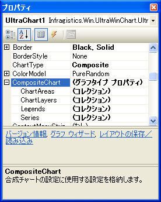
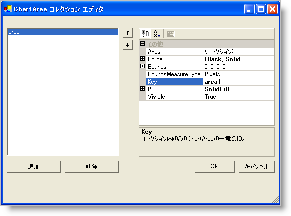
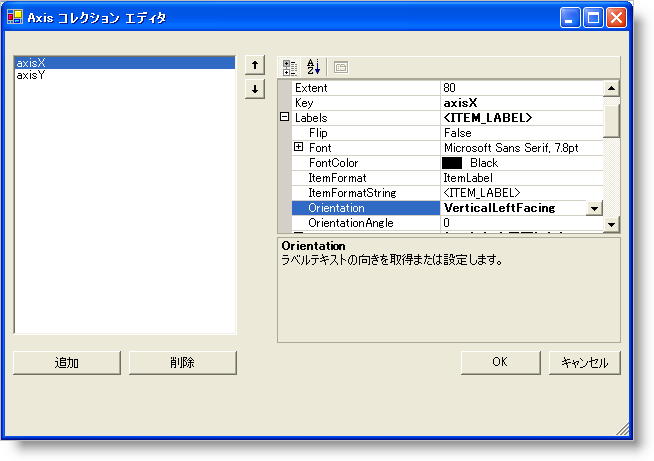
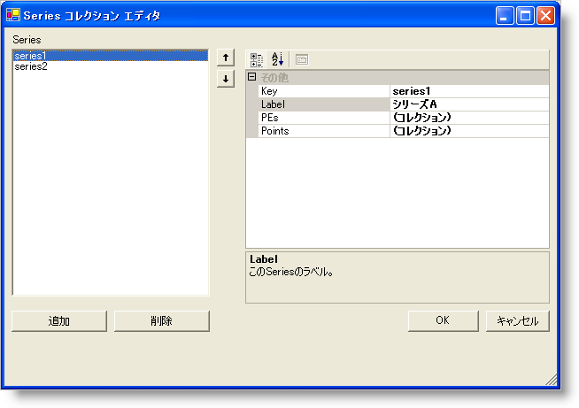
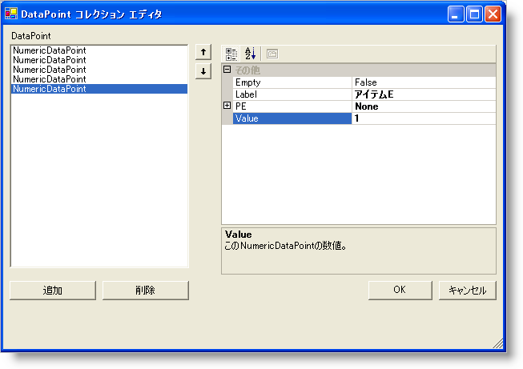
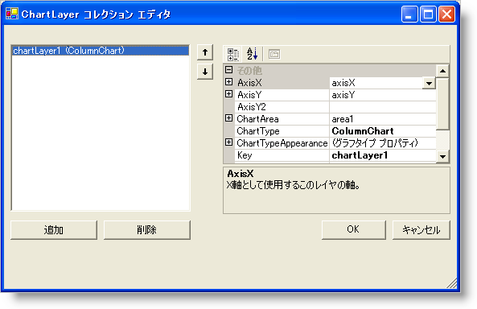
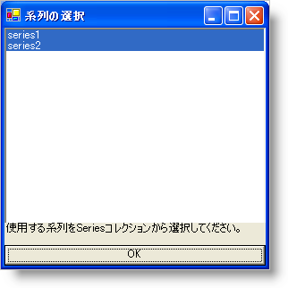
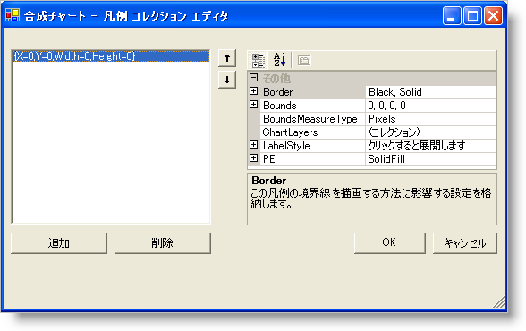
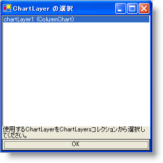

////

|metadata|
{
    "name": "chart-creating-a-composite-chart-using-the-designer-part-1-of-2",
    "controlName": ["{WawChartName}"],
    "tags": [],
    "guid": "{34A56E9F-ABE4-4AAB-9DCB-4EACA53A1D64}",  
    "buildFlags": [],
    "createdOn": "0001-01-01T00:00:00Z"
}
|metadata|
////

= デザイナを使用して合成チャートを作成（1/2）

このチュートリアルは、フォーム デザイナを使用して link:chart-composite-chart.html[合成チャート]の作成プロセスを説明します。このチュートリアルが終わるまでに合成チャートのデザインの大切な知識が得られます。

== 合成チャートの基本設定

合成チャートの最初のチャート レイヤを設定するために必要ないくつかの手順があります。合成チャートでチャートを完全に制御できるようにするには、グラフ領域、軸、およびチャート レイヤなどの個々の要素をすべて手動で追加する必要があります。最初のセクションでは、これらの最初の手順を詳細に学習します。

このセクションの最後では、2 つの軸、1 つのチャート レイヤ、および凡例を持つ合成チャートを作成します。

[start=1]
. pick:[win-forms="link:{ApiPlatform}win.ultrawinchart{ApiVersion}~infragistics.win.ultrawinchart.ultrachart~charttype.html[ChartType]"]  pick:[asp-net="link:{ApiPlatform}webui.ultrawebchart{ApiVersion}~infragistics.webui.ultrawebchart.ultrachart~charttype.html[ChartType]"]  pick:[aspnet-old="link:{ApiPlatform}webui.ultrawebchart{ApiVersion}~infragistics.webui.ultrawebchart.ultrachart~charttype.html[ChartType]"]  プロパティを Composite に変更します。

合成チャートの処理に必要な事項を簡単に説明するメッセージが赤いテキストで表示されます。

このチュートリアルは、これらの手順を詳細に説明することを目的としています。参照するコレクションは、すべてチャートの  pick:[win-forms="link:{ApiPlatform}win.ultrawinchart{ApiVersion}~infragistics.win.ultrawinchart.ultrachart~compositechart.html[CompositeChart]"]  pick:[asp-net="link:{ApiPlatform}webui.ultrawebchart{ApiVersion}~infragistics.webui.ultrawebchart.ultrachart~compositechart.html[CompositeChart]"]  pick:[aspnet-old="link:{ApiPlatform}webui.ultrawebchart{ApiVersion}~infragistics.webui.ultrawebchart.ultrachart~compositechart.html[CompositeChart]"]  プロパティの下にあります。これは、Visual Studio .NET プロパティグリッド内の CompositeChart プロパティを展開して見ることができます。

[start=2]
. pick:[win-forms="link:{ApiPlatform}win.ultrawinchart{ApiVersion}~infragistics.ultrachart.resources.appearance.chartarea.html[ChartArea]"]  pick:[asp-net="link:{ApiPlatform}webui.ultrawebchart{ApiVersion}~infragistics.ultrachart.resources.appearance.chartarea.html[ChartArea]"]  pick:[aspnet-old="link:{ApiPlatform}webui.ultrawebchart{ApiVersion}~infragistics.ultrachart.resources.appearance.chartarea.html[ChartArea]"]  を  pick:[win-forms="link:{ApiPlatform}win.ultrawinchart{ApiVersion}~infragistics.ultrachart.resources.appearance.compositechartappearance~chartareas.html[ChartAreas]"]  pick:[asp-net="link:{ApiPlatform}webui.ultrawebchart{ApiVersion}~infragistics.ultrachart.resources.appearance.compositechartappearance~chartareas.html[ChartAreas]"]  pick:[aspnet-old="link:{ApiPlatform}webui.ultrawebchart{ApiVersion}~infragistics.ultrachart.resources.appearance.compositechartappearance~chartareas.html[ChartAreas]"]  コレクションに追加します。

プロパティ グリッドで ChartAreas コレクションを選択し、その行に表示される省略符号をクリックして編集を開始します。[ChartArea コレクション エディタ] が開きます。[追加] ボタンをクリックして ChartArea をコレクションに追加します。

[start=3]
. pick:[win-forms="link:{ApiPlatform}win.ultrawinchart{ApiVersion}~infragistics.ultrachart.resources.appearance.chartarea~axes.html[軸]"]  pick:[asp-net="link:{ApiPlatform}webui.ultrawebchart{ApiVersion}~infragistics.ultrachart.resources.appearance.chartarea~axes.html[軸]"]  pick:[aspnet-old="link:{ApiPlatform}webui.ultrawebchart{ApiVersion}~infragistics.ultrachart.resources.appearance.chartarea~axes.html[軸]"] をこの ChartArea に追加します。

ChartArea コレクション エディタの Axes プロパティで省略符号をクリックします。[軸コレクション エディタ] が開きます。

Axis コレクション エディタで、[追加] をクリックして横軸を追加します。もう一度 [追加] をクリックし、垂直軸を追加します。プロパティ グリッドの Key プロパティを設定して、各軸に有効な  pick:[win-forms="link:{ApiPlatform}win.ultrawinchart{ApiVersion}~infragistics.ultrachart.resources.appearance.axisitem~key.html[Key]"]  pick:[asp-net="link:{ApiPlatform}webui.ultrawebchart{ApiVersion}~infragistics.ultrachart.resources.appearance.chartarea~key.html[Key]"]  pick:[aspnet-old="link:{ApiPlatform}webui.ultrawebchart{ApiVersion}~infragistics.ultrachart.resources.appearance.chartarea~key.html[Key]"]  を割り当てます。このチュートリアルでは、axisX および axisY のキーが横軸と縦軸で使用されます。

image::images/Chart_Composite_Designers_04.png[]

[start=4]
. 柱状グラフ レイヤで使用する軸を設定します。

このサンプルで最初に追加するレイヤは柱状グラフ レイヤです。したがって、柱状グラフ レイヤの要件を満たすためにこれらの軸を設定しなければなりません。

link:chart-axis-requirements-for-composite-charts.html[合成チャートの軸要件]に記載されているように、柱状グラフ レイヤは、X 軸が文字列の DataType と GroupBySeries の  pick:[win-forms="link:{ApiPlatform}win.ultrawinchart{ApiVersion}~infragistics.ultrachart.resources.appearance.axisitem~setlabelaxistype.html[SetLabelAxisType]"]  pick:[asp-net="link:{ApiPlatform}webui.ultrawebchart{ApiVersion}~infragistics.ultrachart.resources.appearance.axisitem~setlabelaxistype.html[SetLabelAxisType]"]  pick:[aspnet-old="link:{ApiPlatform}webui.ultrawebchart{ApiVersion}~infragistics.ultrachart.resources.appearance.axisitem~setlabelaxistype.html[SetLabelAxisType]"]  を持ち、Y 軸は数値型 DataType を持つ必要があります。これらのプロパティは、Axis コレクション エディタのプロパティ グリッドに設定できます。

前述のように X 軸と Y 軸を設定後、各軸に  pick:[win-forms="link:{ApiPlatform}win.ultrawinchart{ApiVersion}~infragistics.ultrachart.resources.appearance.axislabelappearance~itemformat.html[ItemFormat]"]  pick:[asp-net="link:{ApiPlatform}webui.ultrawebchart{ApiVersion}~infragistics.ultrachart.resources.appearance.axislabelappearance~itemformat.html[ItemFormat]"]  pick:[aspnet-old="link:{ApiPlatform}webui.ultrawebchart{ApiVersion}~infragistics.ultrachart.resources.appearance.axislabelappearance~itemformat.html[ItemFormat]"]  を設定します。柱状グラフでは、X 軸が項目ラベルを表示し、Y 軸がデータ値を表示するのが理想的な設定です。したがって、axisX の ItemFormat は「ItemLabel」に設定し、axisY の ItemFormat は「DataValue」に設定します。これらの変更は、各 Axis の「ラベル」プロパティの下の Axis コレクション エディタのプロパティ グリッドで行うことができます。

X 軸に垂直方向のラベルを付けることも理想的です。この変更は、同じプロパティ グリッドで  pick:[win-forms="link:{ApiPlatform}win.ultrawinchart{ApiVersion}~infragistics.ultrachart.resources.appearance.axislabelappearancebase~orientation.html[Orientation]"]  pick:[asp-net="link:{ApiPlatform}webui.ultrawebchart{ApiVersion}~infragistics.ultrachart.resources.appearance.axislabelappearancebase~orientation.html[Orientation]"]  pick:[aspnet-old="link:{ApiPlatform}webui.ultrawebchart{ApiVersion}~infragistics.ultrachart.resources.appearance.axislabelappearancebase~orientation.html[Orientation]"]  プロパティを axisX の VerticalLeftFacing に変更することで行うことができます。

ここで、各ダイアログで [OK] をクリックして Axis コレクション エディタおよび ChartArea コレクション エディタを閉じます。X 軸と Y 軸がチャート コントロールで表示されます。

image::images/Chart_Composite_Designers_06.png[]

[start=5]
. 

データセットを Series コレクションに追加します。

Chart プロパティ グリッドに戻って、CompositeChart プロパティの下の  pick:[win-forms="link:{ApiPlatform}win.ultrawinchart{ApiVersion}~infragistics.ultrachart.resources.appearance.compositechartappearance~series.html[Series]"]  pick:[asp-net="link:{ApiPlatform}webui.ultrawebchart{ApiVersion}~infragistics.ultrachart.resources.appearance.compositechartappearance~series.html[Series]"]  pick:[aspnet-old="link:{ApiPlatform}webui.ultrawebchart{ApiVersion}~infragistics.ultrachart.resources.appearance.compositechartappearance~series.html[Series]"]  コレクションの省略符号をクリックします。[Series コレクション エディタ] が開きます。

Series コレクション エディタで、[追加] ボタンをクリックして 2 つの Numeric Series を追加します。「Series A」のような有効な値を各データセットの  pick:[win-forms="link:{ApiPlatform}win.ultrawinchart{ApiVersion}~infragistics.ultrachart.data.series.seriesbase~label.html[Label]"]  pick:[asp-net="link:{ApiPlatform}webui.ultrawebchart{ApiVersion}~infragistics.ultrachart.data.series.seriesbase~label.html[Label]"]  pick:[aspnet-old="link:{ApiPlatform}webui.ultrawebchart{ApiVersion}~infragistics.ultrachart.data.series.seriesbase~label.html[Label]"]  プロパティに指定します。

各 Seriesで、プロパティ グリッドの Points プロパティの省略記号をクリックします。[DataPoint コレクション エディタ] が開きます。

DataPoint コレクション エディタでは、[追加] ボタンを数回クリックして複数の DataPoints を追加します。各 DataPoint については、値をプロパティ グリッドの  pick:[win-forms="link:{ApiPlatform}win.ultrawinchart{ApiVersion}~infragistics.ultrachart.resources.appearance.datapointbase~label.html[Label]"]  pick:[asp-net="link:{ApiPlatform}webui.ultrawebchart{ApiVersion}~infragistics.ultrachart.resources.appearance.datapointbase~label.html[Label]"]  pick:[aspnet-old="link:{ApiPlatform}webui.ultrawebchart{ApiVersion}~infragistics.ultrachart.resources.appearance.datapointbase~label.html[Label]"]  および  pick:[win-forms="link:{ApiPlatform}win.ultrawinchart{ApiVersion}~infragistics.ultrachart.resources.appearance.numericdatapoint~value.html[Value]"]  pick:[asp-net="link:{ApiPlatform}webui.ultrawebchart{ApiVersion}~infragistics.ultrachart.resources.appearance.numericdatapoint~value.html[Value]"]  pick:[aspnet-old="link:{ApiPlatform}webui.ultrawebchart{ApiVersion}~infragistics.ultrachart.resources.appearance.numericdatapoint~value.html[Value]"]  プロパティに指定します。以下のようにサンプル データを入力します。

[cols="a,a"]
|====
|Label
|Value

|アイテム A
|5

|アイテム B
|4

|アイテム C
|3

|アイテム D
|2

|アイテム E
|1

|====

ここで、各ダイアログ ボックスで OK ボタンをクリックして DataPoint コレクション エディタおよび Series コレクション エディタを閉じます。
[start=6]
. チャート レイヤを追加します。

UltraChart プロパティ グリッドに戻って、CompositeChart プロパティの下の  pick:[win-forms="link:{ApiPlatform}win.ultrawinchart{ApiVersion}~infragistics.ultrachart.resources.appearance.compositechartappearance~chartlayers.html[ChartLayers]"]  pick:[asp-net="link:{ApiPlatform}webui.ultrawebchart{ApiVersion}~infragistics.ultrachart.resources.appearance.compositechartappearance~chartlayers.html[ChartLayers]"]  コレクションの省略符号をクリックします。[ChartLayer コレクション エディタ] が開きます。

ChartLayer コレクション エディタで、[追加] ボタンをクリックしてチャート レイヤを追加します。

このチャート レイヤのプロパティ グリッドで、ChartArea プロパティを選択します。プロパティ グリッドのこの行は、DropDownList に変わり、そこからグラフ領域（area1）を選択できます。この領域を選択し、  pick:[win-forms="link:{ApiPlatform}win.ultrawinchart{ApiVersion}~infragistics.ultrachart.resources.appearance.chartlayerappearance~axisx.html[AxisX]"]  pick:[asp-net="link:{ApiPlatform}webui.ultrawebchart{ApiVersion}~infragistics.ultrachart.resources.appearance.chartlayerappearance~axisx.html[AxisX]"]  プロパティに「axisX」を、そしてチャート レイヤの  pick:[win-forms="link:{ApiPlatform}win.ultrawinchart{ApiVersion}~infragistics.ultrachart.resources.appearance.chartlayerappearance~axisy.html[AxisY]"]  pick:[asp-net="link:{ApiPlatform}webui.ultrawebchart{ApiVersion}~infragistics.ultrachart.resources.appearance.chartlayerappearance~axisy.html[AxisY]"]  プロパティに「axisY」を選択します。軸要件の詳細は、 link:chart-axis-requirements-for-composite-charts.html[「合成チャートの軸要件」]を参照してください。

これは、文字列の DataType を持つ X 軸、数値の DataType を持つ Y 軸という柱状グラフ レイヤの軸の要件を満たしています。

ここでプロパティ グリッドの「Series」プロパティを選択し、系列の選択を開きます。Ctrl キーを押しながら両方の Series をクリックし、このグラフ レイヤでこれらの両方の Series が使用されるようにします。

[OK] をクリックして系列の選択を終了し、ChartLayer コレクション エディタをもう一度終了します。2 つの軸を持つ単一の ChartArea の合成チャートが 1 つのチャート レイヤを描画します。

[start=7]
. 

凡例をチャートに追加します。

UltraChart プロパティ グリッドに戻って、CompositeChart プロパティの下の  pick:[win-forms="link:{ApiPlatform}win.ultrawinchart{ApiVersion}~infragistics.ultrachart.resources.appearance.compositechartappearance~legends.html[Legends]"]  pick:[asp-net="link:{ApiPlatform}webui.ultrawebchart{ApiVersion}~infragistics.ultrachart.resources.appearance.compositechartappearance~legends.html[Legends]"]  コレクションの省略符号をクリックします。[合成凡例コレクション エディタ] が開きます。

合成凡例コレクション エディタで、[追加] ボタンをクリックして凡例を追加します。

image::images/Chart_Composite_Designers_12.png[]

プロパティ グリッドの ChartLayers プロパティで省略符号をクリックし、使用するこの凡例のレイヤとして chartLayer1 を選択します。

デフォルトで、凡例の枠は Rectangle.Empty に設定されます。したがって、凡例はグラフ面全体を占有し、左上隅から項目の描画が開始されます。凡例の枠をカスタマイズして、チャートの任意の場所に配置し、凡例の枠と背景の  pick:[win-forms="link:{ApiPlatform}win.ultrawinchart{ApiVersion}~infragistics.ultrachart.resources.appearance.paintelement.html[PaintElement]"]  pick:[asp-net="link:{ApiPlatform}webui.ultrawebchart{ApiVersion}~infragistics.ultrachart.resources.appearance.paintelement.html[PaintElement]"]  も同様にカスタマイズできます。チャート ウィザードで、これらのプロパティを試行して、どのように動作するか感触をつかみます。

以下の画像では、凡例の  pick:[win-forms="link:{ApiPlatform}win.ultrawinchart{ApiVersion}~infragistics.ultrachart.resources.appearance.compositelegend~bounds.html[Bounds]"]  pick:[asp-net="link:{ApiPlatform}webui.ultrawebchart{ApiVersion}~infragistics.ultrachart.resources.appearance.compositelegend~bounds.html[Bounds]"]  はパーセントの  pick:[win-forms="link:{ApiPlatform}win.ultrawinchart{ApiVersion}~infragistics.ultrachart.resources.appearance.compositelegend~boundsmeasuretype.html[MeasureType]"]  pick:[asp-net="link:{ApiPlatform}webui.ultrawebchart{ApiVersion}~infragistics.ultrachart.resources.appearance.compositelegend~boundsmeasuretype.html[MeasureType]"]  で {X=0, Y=75, Width=20, } に設定されています。凡例の PaintElement は、CornflowerBlue から Transparent への ForwardDiagonal グラデーションに設定されています。 pick:[win-forms="link:{ApiPlatform}win.ultrawinchart{ApiVersion}~infragistics.ultrachart.resources.appearance.compositelegend~border.html[Border.CornerRadius]"]  pick:[asp-net="link:{ApiPlatform}webui.ultrawebchart{ApiVersion}~infragistics.ultrachart.resources.appearance.compositelegend~border.html[Border.CornerRadius]"]  が 10 に設定されると凡例ボックスの枠に丸みが付けられます。Border.Thickness が 0 に設定されると凡例のデフォルトの黒いアウトラインが削除されます。

image::images/Chart_Composite_Designers_14.png[]

== 関連トピック

link:chart-axis-requirements-for-composite-charts.html[合成チャートの軸要件]

link:chart-layers.html[レイヤ]