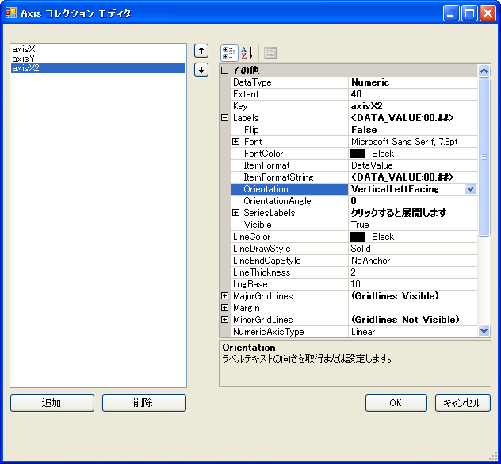
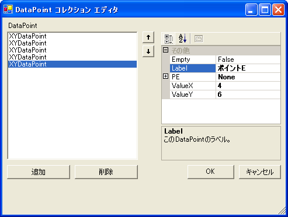
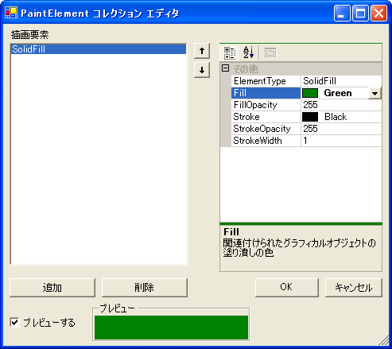
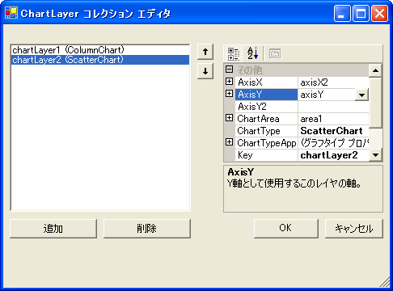

////

|metadata|
{
    "name": "chart-creating-a-composite-chart-using-the-designer-part-2-of-2",
    "controlName": ["{WawChartName}"],
    "tags": [],
    "guid": "{FCF635A9-E127-4C05-BC36-DB64DFFE2A28}",  
    "buildFlags": [],
    "createdOn": "0001-01-01T00:00:00Z"
}
|metadata|
////

= デザイナを使用して合成チャートを作成（2/2）

このトピックでは、 link:chart-creating-a-composite-chart-using-the-designer-part-1-of-2.html[デザイナを使用した合成チャートの作成（パート 1/2）]トピックについて詳しく説明し、レイヤ、グラフ領域、および凡例の追加による link:chart-composite-chart.html[合成チャート]の威力と柔軟性を示します。

[start=1]
. pick:[win-forms="link:{ApiPlatform}win.ultrawinchart{ApiVersion}~infragistics.ultrachart.resources.appearance.chartarea.html[ChartArea]"]  pick:[asp-net="link:{ApiPlatform}webui.ultrawebchart{ApiVersion}~infragistics.ultrachart.resources.appearance.chartarea.html[ChartArea]"]  pick:[aspnet-old="link:{ApiPlatform}webui.ultrawebchart{ApiVersion}~infragistics.ultrachart.resources.appearance.chartarea.html[ChartArea]"]  への別の軸の追加。

別のレイヤを追加する前に、少なくとも 1 つの軸を追加する必要があります。これは、ほとんどのチャート レイヤでラベル用の軸が必要になり、チャート レイヤがラベル軸を共有できないからです。

ChartArea の  pick:[win-forms="link:{ApiPlatform}win.ultrawinchart{ApiVersion}~infragistics.ultrachart.resources.appearance.chartarea~axes.html[Axes]"]  pick:[asp-net="link:{ApiPlatform}webui.ultrawebchart{ApiVersion}~infragistics.ultrachart.resources.appearance.chartarea~axes.html[Axes]"]  pick:[aspnet-old="link:{ApiPlatform}webui.ultrawebchart{ApiVersion}~infragistics.ultrachart.resources.appearance.chartarea~axes.html[Axes]"]  コレクションに戻り、水平軸を追加し、その  pick:[win-forms="link:{ApiPlatform}win.ultrawinchart{ApiVersion}~infragistics.ultrachart.resources.appearance.axisitem~orientationtype.html[OrientationType]"]  pick:[asp-net="link:{ApiPlatform}webui.ultrawebchart{ApiVersion}~infragistics.ultrachart.resources.appearance.axisitem~orientationtype.html[OrientationType]"]  pick:[aspnet-old="link:{ApiPlatform}webui.ultrawebchart{ApiVersion}~infragistics.ultrachart.resources.appearance.axisitem~orientationtype.html[OrientationType]"]  プロパティを "X2_Axis" に設定します。axisX2 のように分かりやすいキーを指定します。これでグラフの上部から方向付けられた軸が追加されます。

pick:[win-forms="link:{ApiPlatform}win.ultrawinchart{ApiVersion}~infragistics.ultrachart.resources.appearance.axisitem~datatype.html[DataType]"]  pick:[asp-net="link:{ApiPlatform}webui.ultrawebchart{ApiVersion}~infragistics.ultrachart.resources.appearance.axisitem~datatype.html[DataType]"]  pick:[aspnet-old="link:{ApiPlatform}webui.ultrawebchart{ApiVersion}~infragistics.ultrachart.resources.appearance.axisitem~datatype.html[DataType]"]  を Numeric に設定します。この軸でデータ値を表示できるように、 pick:[win-forms="link:{ApiPlatform}win.ultrawinchart{ApiVersion}~infragistics.ultrachart.resources.appearance.axislabelappearance~itemformat.html[ItemLabels.ItemFormat]"]  pick:[asp-net="link:{ApiPlatform}webui.ultrawebchart{ApiVersion}~infragistics.ultrachart.resources.appearance.axislabelappearance~itemformat.html[ItemLabels.ItemFormat]"]  pick:[aspnet-old="link:{ApiPlatform}webui.ultrawebchart{ApiVersion}~infragistics.ultrachart.resources.appearance.axislabelappearance~itemformat.html[ItemLabels.ItemFormat]"]  を DataValue に設定します。 pick:[win-forms="link:{ApiPlatform}win.ultrawinchart{ApiVersion}~infragistics.ultrachart.resources.appearance.axislabelappearancebase~orientation.html[ItemLabels.Orientation]"]  pick:[asp-net="link:{ApiPlatform}webui.ultrawebchart{ApiVersion}~infragistics.ultrachart.resources.appearance.axislabelappearancebase~orientation.html[ItemLabels.Orientation]"]  pick:[aspnet-old="link:{ApiPlatform}webui.ultrawebchart{ApiVersion}~infragistics.ultrachart.resources.appearance.axislabelappearancebase~orientation.html[ItemLabels.Orientation]"]  を "VerticalLeftFacing" に設定します。次に、 pick:[win-forms="link:{ApiPlatform}win.ultrawinchart{ApiVersion}~infragistics.ultrachart.resources.appearance.axisappearance~extent.html[Extent]"]  pick:[asp-net="link:{ApiPlatform}webui.ultrawebchart{ApiVersion}~infragistics.ultrachart.resources.appearance.axisappearance~extent.html[Extent]"]  pick:[aspnet-old="link:{ApiPlatform}webui.ultrawebchart{ApiVersion}~infragistics.ultrachart.resources.appearance.axisappearance~extent.html[Extent]"]  を 40 に変更し、グラフの領域を確保します。

[start=2]
. 他のデータセットの追加。

CompositeChart.Series プロパティの省略記号をクリックして、 pick:[win-forms="link:{ApiPlatform}win.ultrawinchart{ApiVersion}~infragistics.ultrachart.resources.appearance.compositechartappearance~series.html[Series]"]  pick:[asp-net="link:{ApiPlatform}webui.ultrawebchart{ApiVersion}~infragistics.ultrachart.resources.appearance.compositechartappearance~series.html[Series]"]  pick:[aspnet-old="link:{ApiPlatform}webui.ultrawebchart{ApiVersion}~infragistics.ultrachart.resources.appearance.compositechartappearance~series.html[Series]"]  コレクション エディタに戻ります。XY Series を Series コレクションに追加します。次に X および Y 値でデータ ポイントを入力します。

[start=3]
. 

このデータセットに色を割り当てるには、[DataPoint コレクション エディタ] を閉じて、[Series コレクション エディタ] に戻ります。次に、このデータセット（series3）の  pick:[win-forms="link:{ApiPlatform}win.ultrawinchart{ApiVersion}~infragistics.ultrachart.data.series.seriesbase~pes.html[PEs]"]  pick:[asp-net="link:{ApiPlatform}webui.ultrawebchart{ApiVersion}~infragistics.ultrachart.data.series.seriesbase~pes.html[PEs]"]  pick:[aspnet-old="link:{ApiPlatform}webui.ultrawebchart{ApiVersion}~infragistics.ultrachart.data.series.seriesbase~pes.html[PEs]"]  プロパティの省略記号をクリックして、そのデータセットの PE コレクションの [ pick:[win-forms="link:{ApiPlatform}win.ultrawinchart{ApiVersion}~infragistics.ultrachart.resources.appearance.paintelement.html[PaintElement]"]  pick:[asp-net="link:{ApiPlatform}webui.ultrawebchart{ApiVersion}~infragistics.ultrachart.resources.appearance.paintelement.html[PaintElement]"]  pick:[aspnet-old="link:{ApiPlatform}webui.ultrawebchart{ApiVersion}~infragistics.ultrachart.resources.appearance.paintelement.html[PaintElement]"]  コレクション エディタ] を開きます。

[追加] ボタンをクリックして、単一の PaintElement を追加し、塗りつぶしの色を 1 つの色（この例では、緑色が使用されます）に設定します。

[start=4]
. 別のチャート レイヤの追加。

CompositeChart.ChartLayers プロパティの省略記号をクリックして、ChartLayer コレクション エディタに戻ります。新しい  pick:[win-forms="link:{ApiPlatform}win.ultrawinchart{ApiVersion}~infragistics.ultrachart.resources.appearance.chartlayerappearance.html[ChartLayer]"]  pick:[asp-net="link:{ApiPlatform}webui.ultrawebchart{ApiVersion}~infragistics.ultrachart.resources.appearance.chartlayerappearance.html[ChartLayer]"]  pick:[aspnet-old="link:{ApiPlatform}webui.ultrawebchart{ApiVersion}~infragistics.ultrachart.resources.appearance.chartlayerappearance.html[ChartLayer]"]  をコレクションに追加し、 pick:[win-forms="link:{ApiPlatform}win.ultrawinchart{ApiVersion}~infragistics.ultrachart.resources.appearance.chartlayerappearance~charttype.html[ChartType]"]  pick:[asp-net="link:{ApiPlatform}webui.ultrawebchart{ApiVersion}~infragistics.ultrachart.resources.appearance.chartlayerappearance~charttype.html[ChartType]"]  pick:[aspnet-old="link:{ApiPlatform}webui.ultrawebchart{ApiVersion}~infragistics.ultrachart.resources.appearance.chartlayerappearance~charttype.html[ChartType]"]  プロパティを ScatterChart に設定します。

ChartArea を area1 に設定し、 pick:[win-forms="link:{ApiPlatform}win.ultrawinchart{ApiVersion}~infragistics.ultrachart.resources.appearance.chartlayerappearance~axisx.html[AxisX]"]  pick:[asp-net="link:{ApiPlatform}webui.ultrawebchart{ApiVersion}~infragistics.ultrachart.resources.appearance.chartlayerappearance~axisx.html[AxisX]"]  pick:[aspnet-old="link:{ApiPlatform}webui.ultrawebchart{ApiVersion}~infragistics.ultrachart.resources.appearance.chartlayerappearance~axisx.html[AxisX]"]  を axisX2、 pick:[win-forms="link:{ApiPlatform}win.ultrawinchart{ApiVersion}~infragistics.ultrachart.resources.appearance.chartlayerappearance~axisy.html[AxisY]"]  pick:[asp-net="link:{ApiPlatform}webui.ultrawebchart{ApiVersion}~infragistics.ultrachart.resources.appearance.chartlayerappearance~axisy.html[AxisY]"]  pick:[aspnet-old="link:{ApiPlatform}webui.ultrawebchart{ApiVersion}~infragistics.ultrachart.resources.appearance.chartlayerappearance~axisy.html[AxisY]"]  を axisY に設定します。

ChartLayer の Series コレクションを開き、XY データセット（series3）を選択します。ここで、コレクション エディタを終了すると、2 番目のチャート レイヤが表示されます。

image::images/Chart_Composite_Designers_19.png[]

これまでの説明で、合成チャート ウィザードについて十分理解し、ユーザーご自身で試行できるようになりました。ユーザーは、アプリケーションのニーズに合うように、チャート レイヤ、軸、凡例、およびグラフ領域を自由に追加することができます。

== 関連トピック

link:chart-axis-requirements-for-composite-charts.html[合成チャートの軸要件]

link:chart-layers.html[レイヤ]