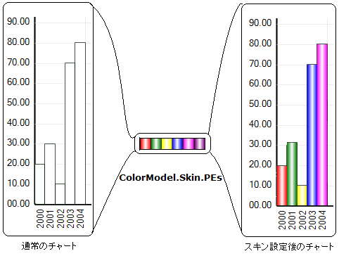
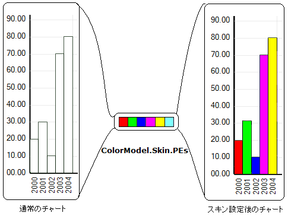

////

|metadata|
{
    "name": "chart-custom-skins-and-paint-elements",
    "controlName": ["{WawChartName}"],
    "tags": [],
    "guid": "{CFFB938C-6DF0-4AFA-A9B1-B00B685C13BA}",  
    "buildFlags": [],
    "createdOn": "0001-01-01T00:00:00Z"
}
|metadata|
////

= カスタム スキンと描画エレメント

グラフの最も簡潔な定義は、「さまざまな形状と色の複数の図形を含む画像」です。カスタム スキンは、グラフ内の各形状の描画に使用する色/スタイルセットを指定します。

== カスタム スキンと描画要素

link:{ApiPlatform}pick:[win-forms="win.ultrawinchart"]pick:[asp-net,aspnet-old="webui.ultrawebchart"]{ApiVersion}~infragistics.ultrachart.resources.appearance.paintelement.html[描画要素]は、色、テクスチャ、およびその他の視覚的なスタイルに関する情報を保持するオブジェクトです。アーティスト的な視点で類推すれば、描画要素はパレットの色を含ませた特定の形状とサイズのペイントブラシのインスタンスです。

image::images/Chart_Custom_Skins_01.png[]

スキンは以下のように説明できます。

* 形状のセット。
* カラー ブラシまたは「描画要素」のセット。

スキンによって、これらの形状を描画要素に関連付けることができます。これを行うには、チャートのカラー モデルを  pick:[win-forms="link:{ApiPlatform}win.ultrawinchart{ApiVersion}~infragistics.ultrachart.shared.styles.colormodels.html[CustomSkin]"]  pick:[asp-net="link:{ApiPlatform}webui.ultrawebchart{ApiVersion}~infragistics.ultrachart.shared.styles.colormodels.html[CustomSkin]"]  pick:[aspnet-old="link:{ApiPlatform}webui.ultrawebchart{ApiVersion}~infragistics.ultrachart.shared.styles.colormodels.html[CustomSkin]"]  に設定して、描画要素をカラー モデルの PaintElement コレクションに追加します。以下のサンプル コードを使用してこれを行えます。

*Visual Basic の場合:*

----
UltraChart.ColorModel.ModelStyle = ColorModels.CustomSkin
UltraChart.ColorModel.Skin.PEs.Add(new PaintElement(Color.Red))
UltraChart.ColorModel.Skin.PEs.Add(new PaintElement(Color.Green))
----

*C# の場合:*

----
UltraChart.ColorModel.ModelStyle = ColorModels.CustomSkin;
UltraChart.ColorModel.Skin.PEs.Add(new PaintElement(Color.Red));
UltraChart.ColorModel.Skin.PEs.Add(new PaintElement(Color.Green));
----

上記のコードは、カラー モデルをカスタム スキンとして設定し、2 つの描画要素をカスタム スキンに追加します。以下の図は、PaintElements を含むグラフに色を付ける概念を示します。左側から右側へ、スキンなしのグラフ、垂直方向のグラデーション描画要素（PE）セット、カスタム スキン設定した グラフです。

以下の図は左側から右側へ、スキンなしのグラフ、 塗り潰し色の描画素（PE）セット、 カスタム スキン設定したグラフです。

== カスタム スキンの適用

描画要素は、グラフ化する項目の行または列全体に適用できます。個々の描画要素は、各項目（列）または各データセット（行）全体に順番に適用できます。以下のプロパティを使用し、グラフ化する項目にスキンを適用する方法を変更できます。

*Visual Basic の場合:*

----
UltraChart.ColorModel.Skin.ApplyRowWise = true
----

*C# の場合:*

----
UltraChart.ColorModel.Skin.ApplyRowWise = true;
----

高度な塗り潰し機能を持つプロパティを提供する Primitives サブクラスと特定の  pick:[win-forms="link:{ApiPlatform}win.ultrawinchart{ApiVersion}~infragistics.ultrachart.resources.appearance.chartappearance.html[ChartAppearance]"]  pick:[asp-net="link:{ApiPlatform}webui.ultrawebchart{ApiVersion}~infragistics.ultrachart.resources.appearance.chartappearance.html[ChartAppearance]"]  pick:[aspnet-old="link:{ApiPlatform}webui.ultrawebchart{ApiVersion}~infragistics.ultrachart.resources.appearance.chartappearance.html[ChartAppearance]"]  サブクラスは PaintElement オブジェクトを使用し、塗り潰し方法と輪郭線の描画方法の特性を記述します。このタイプは、開発者が他の GUI 環境の Brush（ pick:[win-forms="link:{ApiPlatform}win.ultrawinchart{ApiVersion}~infragistics.ultrachart.resources.appearance.paintelement~fill.html[塗り潰し]"]  pick:[asp-net="link:{ApiPlatform}webui.ultrawebchart{ApiVersion}~infragistics.ultrachart.resources.appearance.paintelement~fill.html[塗り潰し]"]  pick:[aspnet-old="link:{ApiPlatform}webui.ultrawebchart{ApiVersion}~infragistics.ultrachart.resources.appearance.paintelement~fill.html[塗り潰し]"] ）や Pen（ pick:[win-forms="link:{ApiPlatform}win.ultrawinchart{ApiVersion}~infragistics.ultrachart.resources.appearance.paintelement~stroke.html[ストローク]"]  pick:[asp-net="link:{ApiPlatform}webui.ultrawebchart{ApiVersion}~infragistics.ultrachart.resources.appearance.paintelement~stroke.html[ストローク]"]  pick:[aspnet-old="link:{ApiPlatform}webui.ultrawebchart{ApiVersion}~infragistics.ultrachart.resources.appearance.paintelement~stroke.html[ストローク]"] ）オブジェクトからすでに予期できるメソッドやプロパティをカプセル化します。PaintElement オブジェクトが適用できるのは、以下の高度な塗り潰し方法のすべてをサポートするオブジェクトに対してのみです。

* 塗り潰し。
* テクスチャを並べた塗り潰し。
* グラデーションの塗り潰し。
* ハッチパターンの塗り潰し。

== 描画要素のプロパティ

*  pick:[win-forms="link:{ApiPlatform}win.ultrawinchart{ApiVersion}~infragistics.ultrachart.resources.appearance.paintelement~imagefitstyle.html[ImageFitStyle]"]  pick:[asp-net="link:{ApiPlatform}webui.ultrawebchart{ApiVersion}~infragistics.ultrachart.resources.appearance.paintelement~imagefitstyle.html[ImageFitStyle]"]  pick:[aspnet-old="link:{ApiPlatform}webui.ultrawebchart{ApiVersion}~infragistics.ultrachart.resources.appearance.paintelement~imagefitstyle.html[ImageFitStyle]"]  - 画像に適用する Fit スタイルを指定します。
*  pick:[win-forms="link:{ApiPlatform}win.ultrawinchart{ApiVersion}~infragistics.ultrachart.resources.appearance.paintelement~elementtype.html[ElementType]"]  pick:[asp-net="link:{ApiPlatform}webui.ultrawebchart{ApiVersion}~infragistics.ultrachart.resources.appearance.paintelement~elementtype.html[ElementType]"]  pick:[aspnet-old="link:{ApiPlatform}webui.ultrawebchart{ApiVersion}~infragistics.ultrachart.resources.appearance.paintelement~elementtype.html[ElementType]"]  - 適用する描画タイプを指定します。オブジェクトは一覧表の型の 1 つにすぎない場合があります。プロパティを設定すると、設定したプロパティは最新の値で自動的に更新されます。開発者は、描画プロパティのいくつかのセット（テクスチャ、グラデーション、ハッチなど）を事前に初期化しておき、アプリケーションの処理時に PaintElement のタイプにその中の 1 つを割り当てて調整することでセット間を切り替えると便利な場合が多くあります。
*  pick:[win-forms="link:{ApiPlatform}win.ultrawinchart{ApiVersion}~infragistics.ultrachart.resources.appearance.paintelement~imagewrapmode.html[ImageWrapMode]"]  pick:[asp-net="link:{ApiPlatform}webui.ultrawebchart{ApiVersion}~infragistics.ultrachart.resources.appearance.paintelement~imagewrapmode.html[ImageWrapMode]"]  pick:[aspnet-old="link:{ApiPlatform}webui.ultrawebchart{ApiVersion}~infragistics.ultrachart.resources.appearance.paintelement~imagewrapmode.html[ImageWrapMode]"]  - テクスチャをタイリングまたはラッピング（あるいはその両方）する方法を定義します。このプロパティを適用するのは、FillImage プロパティで指定したテクスチャの塗り潰しのみです。テクスチャのタイリングの詳細については、WrapMode のトピックを参照してください。
*  pick:[win-forms="link:{ApiPlatform}win.ultrawinchart{ApiVersion}~infragistics.ultrachart.resources.appearance.paintelement~hatch.html[Hatch]"]  pick:[asp-net="link:{ApiPlatform}webui.ultrawebchart{ApiVersion}~infragistics.ultrachart.resources.appearance.paintelement~hatch.html[Hatch]"]  pick:[aspnet-old="link:{ApiPlatform}webui.ultrawebchart{ApiVersion}~infragistics.ultrachart.resources.appearance.paintelement~hatch.html[Hatch]"]  - グラフィカルなオブジェクトに適用するハッチの塗り潰しパターン。関連付けられた Primitive または Appearance オブジェクトのパターン塗り潰しのための  pick:[win-forms="link:{ApiPlatform}win.ultrawinchart{ApiVersion}~infragistics.ultrachart.shared.styles.fillhatchstyle.html[FillHatchStyle]"]  pick:[asp-net="link:{ApiPlatform}webui.ultrawebchart{ApiVersion}~infragistics.ultrachart.shared.styles.fillhatchstyle.html[FillHatchStyle]"]  pick:[aspnet-old="link:{ApiPlatform}webui.ultrawebchart{ApiVersion}~infragistics.ultrachart.shared.styles.fillhatchstyle.html[FillHatchStyle]"]  を指定します。
*  pick:[win-forms="link:{ApiPlatform}win.ultrawinchart{ApiVersion}~infragistics.ultrachart.resources.appearance.paintelement~fill.html[Fill]"]  pick:[asp-net="link:{ApiPlatform}webui.ultrawebchart{ApiVersion}~infragistics.ultrachart.resources.appearance.paintelement~fill.html[Fill]"]  pick:[aspnet-old="link:{ApiPlatform}webui.ultrawebchart{ApiVersion}~infragistics.ultrachart.resources.appearance.paintelement~fill.html[Fill]"]  - 関連付けられたグラフィカルなオブジェクトの塗り潰しの色。Fill は、塗り潰しの色、グラデーションの塗り潰しの開始色（ pick:[win-forms="link:{ApiPlatform}win.ultrawinchart{ApiVersion}~infragistics.ultrachart.resources.appearance.paintelement~fillgradientstyle.html[FillGradientStyle]"]  pick:[asp-net="link:{ApiPlatform}webui.ultrawebchart{ApiVersion}~infragistics.ultrachart.resources.appearance.paintelement~fillgradientstyle.html[FillGradientStyle]"]  pick:[aspnet-old="link:{ApiPlatform}webui.ultrawebchart{ApiVersion}~infragistics.ultrachart.resources.appearance.paintelement~fillgradientstyle.html[FillGradientStyle]"]  を設定した場合。FillStopColor プロパティも参照）、FillHatchStyle パターン塗り潰しの前景色（Hatch プロパティを設定した場合）として交互に使用されます。
*  pick:[win-forms="link:{ApiPlatform}win.ultrawinchart{ApiVersion}~infragistics.ultrachart.resources.appearance.paintelement~fillstopcolor.html[FillStopColor]"]  pick:[asp-net="link:{ApiPlatform}webui.ultrawebchart{ApiVersion}~infragistics.ultrachart.resources.appearance.paintelement~fillstopcolor.html[FillStopColor]"]  pick:[aspnet-old="link:{ApiPlatform}webui.ultrawebchart{ApiVersion}~infragistics.ultrachart.resources.appearance.paintelement~fillstopcolor.html[FillStopColor]"]  - 関連付けられたグラフィカルなオブジェクトの 2 番目の塗り潰しの色。このプロパティ値を使用するのは、FillGradientStyle または Hatch プロパティをサポートされているグラデーションまたはハッチパターンのいずれかに設定した場合のみです。グラデーションは、Fill 色から FillStopColor へのベル曲線の混合です。ハッチでは、このプロパティは背景色を記述します。
*  pick:[win-forms="link:{ApiPlatform}win.ultrawinchart{ApiVersion}~infragistics.ultrachart.resources.appearance.paintelement~fillstopopacity.html[FillStopOpacity]"]  pick:[asp-net="link:{ApiPlatform}webui.ultrawebchart{ApiVersion}~infragistics.ultrachart.resources.appearance.paintelement~fillstopopacity.html[FillStopOpacity]"]  pick:[aspnet-old="link:{ApiPlatform}webui.ultrawebchart{ApiVersion}~infragistics.ultrachart.resources.appearance.paintelement~fillstopopacity.html[FillStopOpacity]"]  - 2 番目の描画ブラシの不透明度。値 0 は半透明のブラシを表し、値 255 は完全に不透明なブラシ（塗り潰した領域の背後にある項目は見えない）を表します。0～255 の間の値はさまざまな透過度を表します。 _alpha_ コンポーネントを持つ色を FillStopColor に割り当てることは可能ですが、そうしない場合には、開発者はそのような不透明度の値を割り当てる必要があります。
*  pick:[win-forms="link:{ApiPlatform}win.ultrawinchart{ApiVersion}~infragistics.ultrachart.resources.appearance.paintelement~fillopacity.html[FillOpacity]"]  pick:[asp-net="link:{ApiPlatform}webui.ultrawebchart{ApiVersion}~infragistics.ultrachart.resources.appearance.paintelement~fillopacity.html[FillOpacity]"]  pick:[aspnet-old="link:{ApiPlatform}webui.ultrawebchart{ApiVersion}~infragistics.ultrachart.resources.appearance.paintelement~fillopacity.html[FillOpacity]"]  - 描画ブラシの不透明度。値 0 は半透明のブラシを表し、値 255 は完全に不透明なブラシ（塗り潰した領域の背後にある項目は見えない）を表します。0～255 の間の値はさまざまな透過度を表します。 _alpha_ コンポーネントを持つ色をFillに割り当てることは可能ですが、そうしない場合には、開発者はそのような不透明度の値を割り当てる必要があります。
*  pick:[win-forms="link:{ApiPlatform}win.ultrawinchart{ApiVersion}~infragistics.ultrachart.resources.appearance.paintelement~fillgradientstyle.html[FillGradientStyle]"]  pick:[asp-net="link:{ApiPlatform}webui.ultrawebchart{ApiVersion}~infragistics.ultrachart.resources.appearance.paintelement~fillgradientstyle.html[FillGradientStyle]"]  pick:[aspnet-old="link:{ApiPlatform}webui.ultrawebchart{ApiVersion}~infragistics.ultrachart.resources.appearance.paintelement~fillgradientstyle.html[FillGradientStyle]"]  - 描画要素のブラシに適用するグラデーション塗り潰しスタイルを決定します。グラデーション塗り潰しは、Fill から開始して FillStopColor に移動する色の線形補間で、色の変化はグラデーション ベクタで指定された方向にあります。
*  pick:[win-forms="link:{ApiPlatform}win.ultrawinchart{ApiVersion}~infragistics.ultrachart.resources.appearance.paintelement~fillimage.html[FillImage]"]  pick:[asp-net="link:{ApiPlatform}webui.ultrawebchart{ApiVersion}~infragistics.ultrachart.resources.appearance.paintelement~fillimage.html[FillImage]"]  pick:[aspnet-old="link:{ApiPlatform}webui.ultrawebchart{ApiVersion}~infragistics.ultrachart.resources.appearance.paintelement~fillimage.html[FillImage]"]  - グラフィカルなオブジェクトに適用するテクスチャ。
*  pick:[win-forms="link:{ApiPlatform}win.ultrawinchart{ApiVersion}~infragistics.ultrachart.resources.appearance.paintelement~stroke.html[Stroke]"]  pick:[asp-net="link:{ApiPlatform}webui.ultrawebchart{ApiVersion}~infragistics.ultrachart.resources.appearance.paintelement~stroke.html[Stroke]"]  pick:[aspnet-old="link:{ApiPlatform}webui.ultrawebchart{ApiVersion}~infragistics.ultrachart.resources.appearance.paintelement~stroke.html[Stroke]"]  - 描画する形状の輪郭線を描くために使用するペンの色。このプロパティを使用して形状の輪郭線の色を指定します。この機能が必要でない場合、以下のいくつかの方法で、Primitives の輪郭線の描画に使用するペンを無効にできます。
** このプロパティを Color.Transparent に設定します。ペンの使用を OFF にする場合これをお勧めします。または、StrokeWidth プロパティを 0 に設定します（これはこのプロパティを Transparent に設定するのと実際的に同じです）。
**  _alpha_  コンポーネントを持つ色を Stroke に直接割り当てることができますが、そうする代わりに開発者は StrokeOpacity プロパティを使用することをお勧めします。

*  pick:[win-forms="link:{ApiPlatform}win.ultrawinchart{ApiVersion}~infragistics.ultrachart.resources.appearance.paintelement~strokeopacity.html[StrokeOpacity]"]  pick:[asp-net="link:{ApiPlatform}webui.ultrawebchart{ApiVersion}~infragistics.ultrachart.resources.appearance.paintelement~strokeopacity.html[StrokeOpacity]"]  pick:[aspnet-old="link:{ApiPlatform}webui.ultrawebchart{ApiVersion}~infragistics.ultrachart.resources.appearance.paintelement~strokeopacity.html[StrokeOpacity]"]  - 描画ペンの不透明度。値 0 は半透明のペンを表し、値 255 は完全に不透明なペンを表します。0～255 の間の値はさまざまな透過度を表します。
** このプロパティ値は、Stroke で定義した色の  _alpha_  コンポーネントをオーバーライドします。

*  pick:[win-forms="link:{ApiPlatform}win.ultrawinchart{ApiVersion}~infragistics.ultrachart.resources.appearance.paintelement~strokewidth.html[StrokeWidth]"]  pick:[asp-net="link:{ApiPlatform}webui.ultrawebchart{ApiVersion}~infragistics.ultrachart.resources.appearance.paintelement~strokewidth.html[StrokeWidth]"]  pick:[aspnet-old="link:{ApiPlatform}webui.ultrawebchart{ApiVersion}~infragistics.ultrachart.resources.appearance.paintelement~strokewidth.html[StrokeWidth]"]  - グラフィカル オブジェクトの輪郭線の描画用のペンの太さ。

== 関連トピック

link:chart-render-charts-using-the-paint-element.html[描画要素を使用してチャートを描画]