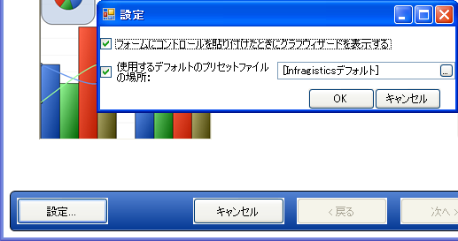

////

|metadata|
{
    "name": "chart-default-preset",
    "controlName": ["{WawChartName}"],
    "tags": [],
    "guid": "{0863AA6B-749B-4BCB-A983-BA2A334B14E1}",  
    "buildFlags": [],
    "createdOn": "0001-01-01T00:00:00Z"
}
|metadata|
////

= デフォルト プリセット

Chart コントロールはデフォルト プリセットを提供します。デフォルト プリセットを使用して、フォームに初めて追加されるときにチャートのデフォルト設定を変更できます。デフォルト プリセット機能は、 link:chart-smart-tickmarks.html[スマート目盛り]などの有用なチャート機能を有効にして、使用されるフォントや色を調整することでチャートのデフォルトの外観を向上することができます。開発者のマシンのデフォルト プリセットを、選択したプリセットに変更することも可能です。

以下は、デフォルト プリセット機能を有効にしたチャートのサンプル画像です。

image::images/Chart_Default_Preset_01.png[]

マシンでデフォルト プリセットを変更するには、チャート ウィザードを開き、[プレファレンス] ボタンをクリックします。次に、入力フィールドを使用して、新しいデフォルト プリセットへのパスを指定します。[使用するデフォルトのプリセットファイルの場所:] チェックボックスの選択を解除することで、デフォルト プリセット機能は無効にすることもできます。

チャートのプリセットは非常に分かりやすいテキストの XML であるため、テキスト エディタで、またはランタイムに  pick:[win-forms="link:{ApiPlatform}win.ultrawinchart{ApiVersion}~infragistics.win.ultrawinchart.ultrachart~savepreset.html[SavePreset]"]  pick:[asp-net="link:{ApiPlatform}webui.ultrawebchart{ApiVersion}~infragistics.webui.ultrawebchart.ultrachart~savepreset.html[SavePreset]"]  pick:[aspnet-old="link:{ApiPlatform}webui.ultrawebchart{ApiVersion}~infragistics.webui.ultrawebchart.ultrachart~savepreset.html[SavePreset]"]  メソッドを使用して作成することができます。いくつかのプリセットは、Infragistics インストーラがプリセットを配置している "\Program Files\Common Files\Infragistics\Presets\" フォルダに提供されています。