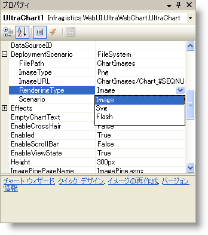

////

|metadata|
{
    "name": "chart-rendering-types",
    "controlName": ["{WawChartName}"],
    "tags": [],
    "guid": "{1BDC9B7F-62C8-4311-9DEC-D2761758080E}",  
    "buildFlags": ["asp-net","aspnet-old"],
    "createdOn": "0001-01-01T00:00:00Z"
}
|metadata|
////

= レンダリングの種類

WebChart は DeploymentScenario. pick:[asp-net="link:{ApiPlatform}webui.ultrawebchart{ApiVersion}~infragistics.ultrachart.shared.styles.renderingtype.html[RenderingType]"]  pick:[aspnet-old="link:{ApiPlatform}webui.ultrawebchart{ApiVersion}~infragistics.ultrachart.shared.styles.renderingtype.html[RenderingType]"]  プロパティの設定に基づき、3 つの方法で描画できます。

以下は、描画タイプでの検討事項と 3 つの描画タイプのリストです。

[options="header", cols="a,a"]
|====
|描画タイプ|説明

|Image
|この描画タイプはラスター ベースです。生成した画像のサイズを変更すると画像の品質は低下します。サーバーでコントロールのサイズを変更すると、画像のサイズを大きくしたり質を高めたり、生成したファイルのサイズも大きくすることができます。画像は Web ページから簡単にコピーでき、Microsoft Word などの多くのドキュメント フォーマットに組み込むことができます。

|Flash (SWF)
|この描画タイプはベクター ベースです。画像のサイズを変更しても外観の質は変化しません。Flash は高品質で印刷できます。SWF はファイル サイズを最小限にするための優れた圧縮機能のバイナリ フォーマットです。 

SWF はファイル サイズを最小限にするための優れた圧縮機能のバイナリ フォーマットです。 

Web の大多数のユーザーは Macromedia Flash Player をインストールしています。Flash Player は複数の Web ブラウザや多くのコンピュータにプリインストールされています。Windows XP や Apple Macintosh オペレーティング システム、Netscape Navigator、America Online などに含まれています。

|SVG（Scalable Vector Graphics）
|この描画タイプはベクター ベースです。画像のサイズを変更しても外観の質は変化しません。SVG は高品質で印刷できます。SVG のテキストは、選択して他のドキュメントにコピーできます。 

ほとんどのユーザーは、この段階で SVG ビューアーをインストールしていません。ただし、インストールしていなくとも、SVG ビューアーをインストールするように自動的にユーザーに促すようにページにスクリプトを組み込むことができます。この例については、Ultimate UI for ASP.NET サンプル ブラウザの Rendering Types のサンプルを参照してください。

|====

== 関連トピック

link:chart-change-a-webcharts-height-and-width-using-percentage-values.html[パーセント値を使用して WebChart の高さと幅を変更]