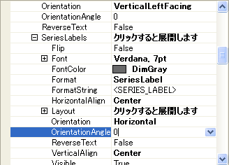

////

|metadata|
{
    "name": "chart-rotate-series-labels",
    "controlName": ["{WawChartName}"],
    "tags": [],
    "guid": "{12C59F2B-2977-46A5-B415-327C7C47A9F0}",  
    "buildFlags": [],
    "createdOn": "0001-01-01T00:00:00Z"
}
|metadata|
////

= シリーズ ラベルの回転

2005 Volume 1 では、グラフに機能が追加され、項目ラベルに設定できるプロパティと同じすべてのプロパティを設定し、ラベルの回転も含めて、データセット ラベルに設定できるようになりました。

このトピックでは、チャートはすでに  pick:[win-forms="link:{ApiPlatform}win.ultrawinchart{ApiVersion}~infragistics.win.ultrawinchart.ultrachart~datasource.html[DataSource]"]  pick:[asp-net="link:{ApiPlatform}webui.ultrawebchart{ApiVersion}~infragistics.webui.ultrawebchart.ultrachart~datasource.html[DataSource]"]  pick:[aspnet-old="link:{ApiPlatform}webui.ultrawebchart{ApiVersion}~infragistics.webui.ultrawebchart.ultrachart~datasource.html[DataSource]"]  プロパティが設定されていることを前提とします。これを実行する詳細は、 link:chart-data-sources.html[「データ ソース」]を参照してください。

[start=1]
. デザイン ビューで開いたフォームを使用してグラフを選択した場合は、プロパティ グリッドで  pick:[win-forms="link:{ApiPlatform}win.ultrawinchart{ApiVersion}~infragistics.win.ultrawinchart.ultrachart~axis.html[Axis]"]  pick:[asp-net="link:{ApiPlatform}webui.ultrawebchart{ApiVersion}~infragistics.webui.ultrawebchart.ultrachart~axis.html[Axis]"]  pick:[aspnet-old="link:{ApiPlatform}webui.ultrawebchart{ApiVersion}~infragistics.webui.ultrawebchart.ultrachart~axis.html[Axis]"]  プロパティに移動します。ここで、Axis プロパティを展開すると、使用可能なすべての軸がリスト表示されます。これらの軸はすべて同じプロパティを使用できるため、これらの軸のいずれか 1 つに焦点を合わせます。X プロパティを展開し、その下にある  pick:[win-forms="link:{ApiPlatform}win.ultrawinchart{ApiVersion}~infragistics.ultrachart.resources.appearance.axisappearance~labels.html[Labels]"]  pick:[asp-net="link:{ApiPlatform}webui.ultrawebchart{ApiVersion}~infragistics.ultrachart.resources.appearance.axisappearance~labels.html[Labels]"]  pick:[aspnet-old="link:{ApiPlatform}webui.ultrawebchart{ApiVersion}~infragistics.ultrachart.resources.appearance.axisappearance~labels.html[Labels]"]  プロパティを展開します。
[start=2]
. 使用可能ないくつかのプロパティが表示されます。このレベルのプロパティは項目ラベルに適用されます。Series Labels プロパティを表示するには、 pick:[win-forms="link:{ApiPlatform}win.ultrawinchart{ApiVersion}~infragistics.ultrachart.resources.appearance.axislabelappearance~serieslabels.html[SeriesLabels]"]  pick:[asp-net="link:{ApiPlatform}webui.ultrawebchart{ApiVersion}~infragistics.ultrachart.resources.appearance.axislabelappearance~serieslabels.html[SeriesLabels]"]  pick:[aspnet-old="link:{ApiPlatform}webui.ultrawebchart{ApiVersion}~infragistics.ultrachart.resources.appearance.axislabelappearance~serieslabels.html[SeriesLabels]"]  プロパティを展開します。使用可能な Item Labels プロパティと使用可能な Series Labels プロパティは類似しています。

[start=3]
. この新しい機能が提供する最大の利点の 1 つは、Series Labels を回転する機能です。SeriesLabels で回転を実行するために、これらのラベルの回転方法を変更する 2 つのプロパティがあります。1 つは、 pick:[win-forms="link:{ApiPlatform}win.ultrawinchart{ApiVersion}~infragistics.ultrachart.resources.appearance.axislabelappearancebase~orientation.html[Orientation]"]  pick:[asp-net="link:{ApiPlatform}webui.ultrawebchart{ApiVersion}~infragistics.ultrachart.resources.appearance.axislabelappearancebase~orientation.html[Orientation]"]  pick:[aspnet-old="link:{ApiPlatform}webui.ultrawebchart{ApiVersion}~infragistics.ultrachart.resources.appearance.axislabelappearancebase~orientation.html[Orientation]"]  です。このプロパティをその他のオプションのいずれかに変更して、ラベルを回転できます。Custom と呼ばれる Orientation の最後のオプションでは、 pick:[win-forms="link:{ApiPlatform}win.ultrawinchart{ApiVersion}~infragistics.ultrachart.resources.appearance.axislabelappearancebase~orientationangle.html[OrientationAngle]"]  pick:[asp-net="link:{ApiPlatform}webui.ultrawebchart{ApiVersion}~infragistics.ultrachart.resources.appearance.axislabelappearancebase~orientationangle.html[OrientationAngle]"]  pick:[aspnet-old="link:{ApiPlatform}webui.ultrawebchart{ApiVersion}~infragistics.ultrachart.resources.appearance.axislabelappearancebase~orientationangle.html[OrientationAngle]"]  プロパティを任意の角度に設定して、ラベルを回転できます。
[start=4]
. たとえば、Orientation を Custom に設定し、OrientationAngle を 40 に設定すると、グラフの Series Labels が回転して、以下のスクリーンショットのように表示されます。

image::images/Chart_Custom_Orientation_Series_Labels_02.png[]