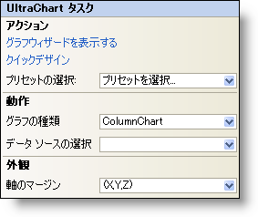

////

|metadata|
{
    "name": "chart-webchart-smart-tag",
    "controlName": ["{WawChartName}"],
    "tags": [],
    "guid": "{BDC6296E-1F3C-430F-9345-E73D733341C5}",  
    "buildFlags": ["asp-net","aspnet-old"],
    "createdOn": "2005-04-11T00:00:00Z"
}
|metadata|
////

= WebChart スマート タグ

Visual Studio 2005（.NET Framework 2.0）では、Ultimate UI for ASP.NET の個々のコントロール/コンポーネントにはスマート タグがあります。コントロールやコンポーネントを選択するだけで、スマート タグのアンカーが表示されます。このアンカーをクリックするとポップアップ パネルが表示され、そこからコントロール/コンポーネントの最もよく使用するプロパティや設定にすばやく簡単にアクセスできます。

WebChart のスマート タグには次のセクションが含まれています。

* アクション -- Chart ウィザードおよびクイック デザインへの素早いアクセスを提供し、これによってグラフの作成と設定ができます。
* 動作 -- フォーム上でのコントロールの動作を制御するプロパティに簡単にアクセスできます。
* 外観 -- コントロールの外観やルック アンド フィールに関連する一般的なタスクがあります。

各セクションの項目（ドロップダウン リストなど）の説明と、プロパティ グリッド内のその項目が対応するプロパティについては、以下を参照してください。

[options="header", cols="a,a,a"]
|====
|アクション|説明|対応するプロパティ

|グラフウィザードを表示する
|[チャート ウィザードを表示する] をクリックすると、チャート ウィザードが表示されます。WebChart コントロールの右クリック メニューから [チャート ウィザード] を選択してチャート ウィザードを開くこともできます。
|なし

|クイック デザイン
|クイック デザインをクリックすると、WebChart の [クイック デザイン] にアクセスします。WebChart コントロールを右クリックして、ポップアップ メニューからクイック デザインを選択することによってもアクセスできます。
|なし

|プリセットの選択
|ドロップダウン リストを使用して、WebChart のプリセットをすばやく選択できます。これは、クイック デザイナを開いて [プリセット] を展開してから [プリセットの管理] をクリックするのと同じです。
|なし

|====

[options="header", cols="a,a,a"]
|====
|動作|説明|対応するプロパティ

|グラフの種類
|ドロップダウン矢印をクリックすると、使用可能な数多くのグラフの種類がグラフィカルに表示されます。
| pick:[asp-net="link:{ApiPlatform}webui.ultrawebchart{ApiVersion}~infragistics.webui.ultrawebchart.ultrachart~charttype.html[ChartType]"] pick:[aspnet-old="link:{ApiPlatform}webui.ultrawebchart{ApiVersion}~infragistics.webui.ultrawebchart.ultrachart~charttype.html[ChartType]"] 

|データソースの選択
|WebChart で使用するデータソースをドロップダウン リストから選択します。データソースをまだ設定していない場合は、[新しいデータソース...] を選択します。
| pick:[asp-net="link:{ApiPlatform}webui.ultrawebchart{ApiVersion}~infragistics.ultrachart.resources.appearance.dataappearance~datasource.html[DataSource]"] pick:[aspnet-old="link:{ApiPlatform}webui.ultrawebchart{ApiVersion}~infragistics.ultrachart.resources.appearance.dataappearance~datasource.html[DataSource]"] 

|====

[options="header", cols="a,a,a"]
|====
|外観|説明|対応するプロパティ

|軸のマージン
|ドロップダウン矢印をクリックすると、X 軸と Y 軸を表す図が表示されます。マージンを変更する軸をドラッグします。
| pick:[asp-net="link:{ApiPlatform}webui.ultrawebchart{ApiVersion}~infragistics.webui.ultrawebchart.ultrachart~axis.html[Axis]"] pick:[aspnet-old="link:{ApiPlatform}webui.ultrawebchart{ApiVersion}~infragistics.webui.ultrawebchart.ultrachart~axis.html[Axis]"] 

|====