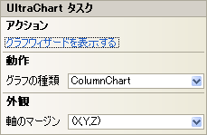

////

|metadata|
{
    "name": "chart-winchart-smart-tag",
    "controlName": ["{WawChartName}"],
    "tags": [],
    "guid": "{062BA0E4-743A-4971-9D1C-F4B0B56C9130}",  
    "buildFlags": ["win-forms","win-forms-old"],
    "createdOn": "2005-04-11T00:00:00Z"
}
|metadata|
////

= WinChart スマート タグ

Visual Studio 2005（.NET Framework 2.0）では、Infragistics Windows フォーム コントロール/コンポーネントがそれぞれ固有のスマート タグを備えています。コントロールやコンポーネントを選択するだけで、スマート タグのアンカーが表示されます。このアンカーをクリックするとポップアップ パネルが表示され、そこからコントロール/コンポーネントの最もよく使用するプロパティや設定にすばやく簡単にアクセスできます。

WinChart のスマート タグには次のセクションが含まれています。

* アクション -- Chart Wizard への素早いアクセスを提供し、これによってグラフの作成と設定ができます。
* 動作 -- フォーム上でのコントロールの動作を制御するプロパティに簡単にアクセスできます。
* 外観 -- コントロールの外観やルック アンド フィールに関連する一般的なタスクがあります。

各セクションの項目（ドロップダウン リストなど）の説明と、プロパティ グリッド内のその項目が対応するプロパティについては、以下を参照してください。

[options="header", cols="a,a,a"]
|====
|アクション|説明|対応するプロパティ

|チャート ウィザードを表示する
|チャート ウィザードを表示します。グラフの右クリック メニューから [チャート ウィザード] を選択してチャート ウィザードを開くこともできます。
|なし

|プリセットを読み込みます。
|[プリセットをロード] ダイアログ ボックスを表示します。これによって、使用可能な Microsoft® Office 2007 スタイルのプリセットから選択できます。チャートを右クリックして [プリセットをロード] を選択して [プリセットをロード] ダイアログ ボックスにアクセスすることもできます。
|なし

|====

[options="header", cols="a,a,a"]
|====
|動作|説明|対応するプロパティ

|グラフの種類
|ドロップダウン矢印をクリックすると、使用可能な数多くのグラフの種類がグラフィカルに表示されます。
| link:{ApiPlatform}win.ultrawinchart{ApiVersion}~infragistics.win.ultrawinchart.ultrachart~charttype.html[ChartType]

|====

[options="header", cols="a,a,a"]
|====
|外観|説明|対応するプロパティ

|軸のマージン
|ドロップダウン矢印をクリックすると、X 軸と Y 軸を表す図が表示されます。マージンを変更する軸をドラッグします。
| link:{ApiPlatform}win.ultrawinchart{ApiVersion}~infragistics.win.ultrawinchart.ultrachart~axis.html[Axis]

|====